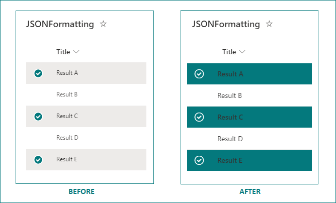

# Highlight Selected List Item Rows

## Summary

This view formatting sample can be used to customize the list or compact list layout to highlight selected list item rows using `@isSelected` token and `additionalRowClass` property in view formatting.

**Before/After applying view formatting**:

## View requirements

View with **List** or **Compact List** layout.

## Sample

Solution|Author(s)
--------|---------
highlight-selected-item-rows.json | [Ganesh Sanap](https://github.com/ganesh-sanap) ([@GaneshSanap20](https://twitter.com/GaneshSanap20))

## Version history

Version |Date            |Comments
--------|----------------|--------------------------------
1.0     |August 24, 2022 |Initial release

## Disclaimer

**THIS CODE IS PROVIDED *AS IS* WITHOUT WARRANTY OF ANY KIND, EITHER EXPRESS OR IMPLIED, INCLUDING ANY IMPLIED WARRANTIES OF FITNESS FOR A PARTICULAR PURPOSE, MERCHANTABILITY, OR NON-INFRINGEMENT.**

