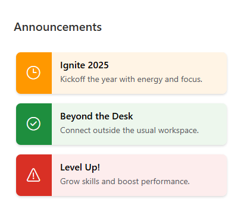
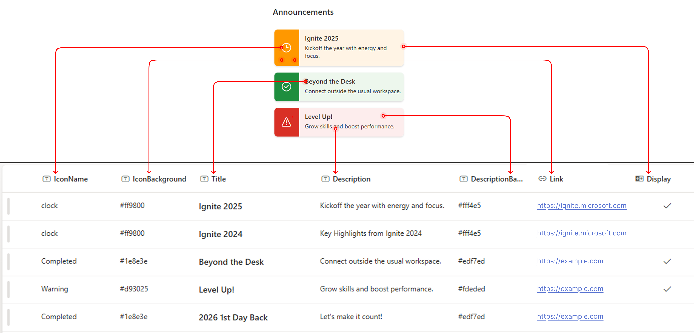

# Highlighted Announcements

## Summary
A SharePoint list formatting sample that visually emphasizes important announcements to draw attention using custom icons, background colors, titles, descriptions, and links, inspired by the [announcements](https://github.com/pnp/List-Formatting/tree/master/view-samples/announcements) sample.

## View requirements
Column Name | Type | Decription
-|-|-
IconName | Single line of text | https://www.flicon.io
IconBackground | Single line of text | Hex color code
Title | Single line of text | Announcement title
Description | Single line of text | Announcement description
DescriptionBackground | Single line of text | Hex color code
Link | Hyperlink | Announcement detail
Display | Yes/No | Show or hide announcements

> [!NOTE]
> It is necessary to include the columns in the view or it won't work as excpected.

## Sample

Solution|Author(s)
--------|-
highlighted-announcements.json | [Watana](https://github.com/watana2)

## Version history
Version|Date|Comments
-------|----|-
1.0    | August 24, 2025 | Initial release

## Disclaimer
**THIS CODE IS PROVIDED *AS IS* WITHOUT WARRANTY OF ANY KIND, EITHER EXPRESS OR IMPLIED, INCLUDING ANY IMPLIED WARRANTIES OF FITNESS FOR A PARTICULAR PURPOSE, MERCHANTABILITY, OR NON-INFRINGEMENT.**

