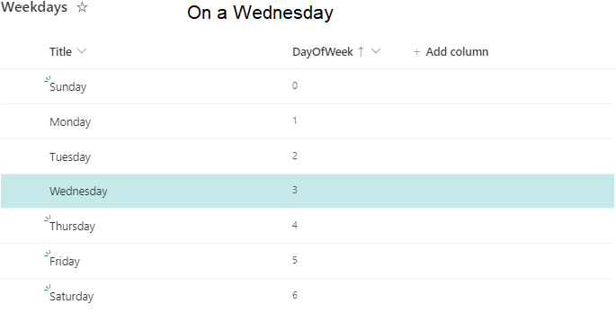

# Hightlight rows on current day of the week

## Summary
This sample demonstrates formatting items differently based on the current day of the week.

As there is no default "WEEKDAY" function in list formatting, we use the datestamp and some math to calculate the day of the week manually.

## The Math

The expression
> =Number(Date(@now))

gives us the number of milliseconds since Thursday, 01/01/1970 UTC and

> =floor(Number(Date(@now))/86400/1000)

the number of days since that date.

As "01/01/1970 UTC" was a Thursday, we now need to add 4 to that to select Sunday as the start of the week. Now we can use modulo-7 to get the day of the week in UTC.

> =(floor(Number(Date(@now))/86400/1000)+4)%7

But this gives us the current day of the week right now in London.

To adjust that to your local timezone, we need to add the difference in milliseconds between your local time of 00:00 and UTC's time of 00:00. I calculate that by subtracting the time in milliseconds from a local UTC timestamp of "01.01.2020" from 1577836800000 (the UTC time in milliseconds of "01.01.2020")

> =1577836800000-Number(Date('01.01.2020')

Putting it all together we get the following formula to calculate the local day of the week

> =(floor(((Number(Date(@now))+1577836800000-Number(Date('01.01.2020')))/86400/1000)+4)%7

This formula is used in the sample.

## By the way

Using the same math you can easily calculate your local offset in hours from UTC.

> =floor((1577836800001-Number(Date('01.01.2020')))/3600/1000)

(I added 1 to 1577836800000 and used the floor function to make sure that we don't get a "Division by Zero" error)

## View requirements
The format expect the following fields:

|Type|Internal Name|
|---|---|
|Number|DayOfWeek|

Insert the following numbers into the fields to hightlight the row on the current day of the week:

Day of the week |Number
--------|---------
Sunday | 0
Monday | 1
Tuesday | 2
Wednesday | 3
Thursday | 4
Friday | 5
Saturday | 6

## Sample

Solution|Author(s)
--------|---------
hightlight-rows-current-weekday.json | [Sven Sieverding](https://github.com/365knoten)

## Version history

Version|Date|Comments
-------|----|--------
1.0|November 27, 2022|Initial release

## Disclaimer
**THIS CODE IS PROVIDED *AS IS* WITHOUT WARRANTY OF ANY KIND, EITHER EXPRESS OR IMPLIED, INCLUDING ANY IMPLIED WARRANTIES OF FITNESS FOR A PARTICULAR PURPOSE, MERCHANTABILITY, OR NON-INFRINGEMENT.**

