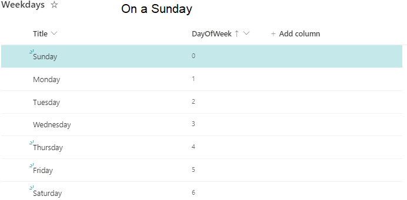
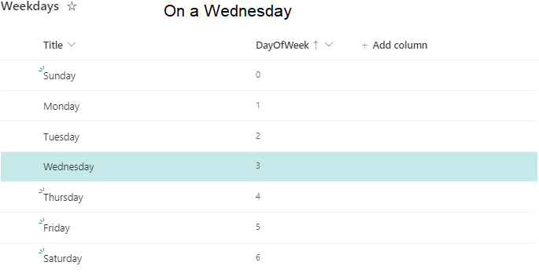

# Hightlight rows on current day of the week

## Summary
This sample demonstrates formatting items differently based on the current day of the week. 

As there is no default "WEEKDAY" function in list formatting we are using the datestamp and some math to calculate the day of the week manually.

> floor(Number(Date(@now))/ 86400 / 1000)+4) % 7

### Screenshots

## View requirements
- The format expect the following fields:

Field |Type
--------|---------
Weekday | Number

Insert the following numbers into the fields to hightlight the row on the current day of the week:

Day of the week |Number
--------|---------
Sunday | 0
Monday | 1
Tuesday | 2
Wednesday | 3
Thursday | 4
Friday | 5
Saturday | 6

## Sample

Solution|Author(s)
--------|---------
weekday.json | [Sven Sieverding](https://github.com/365knoten)

## Version history

Version|Date|Comments
-------|----|--------
1.0|November 27, 2022|Initial release

## Disclaimer
**THIS CODE IS PROVIDED *AS IS* WITHOUT WARRANTY OF ANY KIND, EITHER EXPRESS OR IMPLIED, INCLUDING ANY IMPLIED WARRANTIES OF FITNESS FOR A PARTICULAR PURPOSE, MERCHANTABILITY, OR NON-INFRINGEMENT.**

