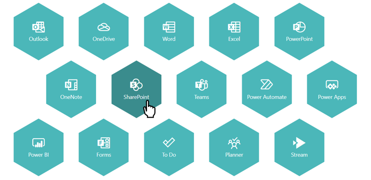

# Honeycomb Links

## Summary
This sample demonstrates a honeycomb structure of links. The hexagons are displayed using SVG, so that five hexagons are displayed per line. This sample uses the Icons from the Fluent UI. The name of the icon is referenced through an `Icon` field.

## View requirements

|Type               |Internal Name|Required|
|-------------------|-------------|:------:|
|Single line of text|Title        |Yes     |
|Single line of text|URL          |Yes     |
|Single line of text|Icon         |Yes     |

## Sample

Solution|Author(s)
--------|---------
honeycomb-link.json | [Tetsuya Kawahara](https://github.com/tecchan1107) ([@techan_k](https://twitter.com/techan_k))

## Version history

Version |Date         |Comments
--------|-------------|--------------------------------
1.0     |July 5, 2021 |Initial release
1.1     |June 11, 2022|Fixed where to apply mouse hover effect

## Disclaimer
**THIS CODE IS PROVIDED *AS IS* WITHOUT WARRANTY OF ANY KIND, EITHER EXPRESS OR IMPLIED, INCLUDING ANY IMPLIED WARRANTIES OF FITNESS FOR A PARTICULAR PURPOSE, MERCHANTABILITY, OR NON-INFRINGEMENT.**

## Additional notes
- [Fluent UI Icons](https://developer.microsoft.com/en-us/fluentui#/styles/web/icons)

