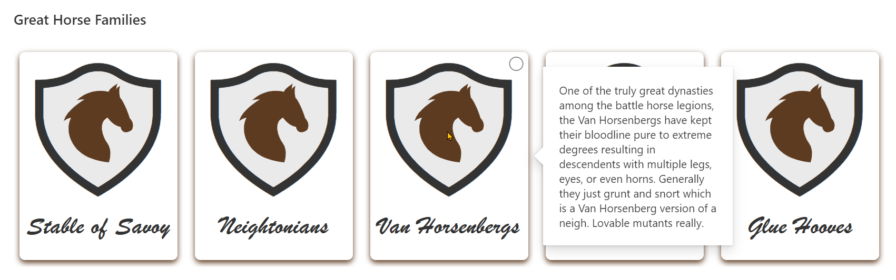

# Horse Crests

## Summary

This sample illustrates some advanced techniques for applying theme colors to SVG elements, box-shadows, and borders. It also demonstrates using custom hover cards on complex elements (elements with children).

## View requirements

|Type|Internal Name|Required|
|---|---|:---:|
|Single line of text|Title|Yes|
|Multiple line of text|History|Yes|

## Sample

Solution|Author(s)
--------|---------
horse-crests.json | [Chris Kent](https://github.com/thechriskent)

## Version history

Version|Date|Comments
-------|----|--------
1.0|November 12, 2020|Initial release

## Disclaimer

**THIS CODE IS PROVIDED *AS IS* WITHOUT WARRANTY OF ANY KIND, EITHER EXPRESS OR IMPLIED, INCLUDING ANY IMPLIED WARRANTIES OF FITNESS FOR A PARTICULAR PURPOSE, MERCHANTABILITY, OR NON-INFRINGEMENT.**

---

## Additional notes
None

