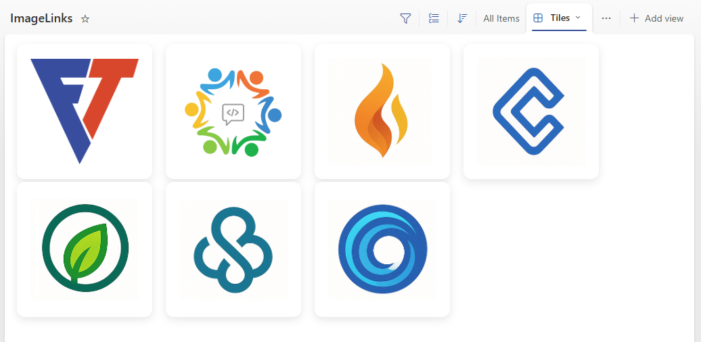

# Image Card Tiles

## Summary
This sample displays images in a visually appealing tile layout with modern styling using SharePoint's Gallery view. Each image tile is clickable and navigates to a URL specified in another column. The tiles feature rounded corners, shadow effects, and a clean design that works well for image galleries, catalogs, or showcase layouts.

**Note**: This is a view formatter (tile formatter) that should be applied to a Gallery view, not a column formatter.

## View requirements
- Create a view based on `Gallery` layout
- Apply this formatter to the tile view

|Type|Internal Name|Required|Purpose|
|----|-------------|--------|-------|
|Single line of text|Title|Yes|Accessibility alt text|
|Hyperlink or Picture|ImageURL|Yes|Image URL|
|Hyperlink or Picture|URL|No|Contains the target link|

## Sample

Solution|Author(s)
--------|---------
image-card-tiles.json | [Nanddeep Nachan](https://github.com/nanddeepn), [Smita Nachan](https://github.com/smitanachan)

## Version history

Version|Date|Comments
-------|----|--------
1.0|August 11, 2025|Initial release

## Disclaimer

**THIS CODE IS PROVIDED *AS IS* WITHOUT WARRANTY OF ANY KIND, EITHER EXPRESS OR IMPLIED, INCLUDING ANY IMPLIED WARRANTIES OF FITNESS FOR A PARTICULAR PURPOSE, MERCHANTABILITY, OR NON-INFRINGEMENT.**

---

## How it works

This formatter creates a modern tile-based layout for displaying images in a SharePoint list or library gallery view with the following features:

### Structure:
1. **Container**: A flex container with rounded corners and shadow effect
2. **Clickable Link**: The entire tile is wrapped in an anchor tag that links to the URL column
3. **Image Display**: Images are displayed using `object-fit: contain` to maintain aspect ratio
4. **Responsive Design**: The tiles maintain consistent dimensions while adapting to different screen sizes

### Key Features:
- **Modern Styling**: Clean design with rounded corners, shadows, and proper spacing
- **Accessibility**: Includes proper alt text from the Title column
- **Link Integration**: Seamlessly integrates with URL columns for navigation
- **Consistent Layout**: Fixed tile dimensions ensure uniform appearance
- **Visual Feedback**: Hover and focus states provide user interaction feedback

## Browser Compatibility:
This formatter uses modern CSS properties including flexbox, object-fit, and box-shadow, which are supported in all modern browsers.

## Additional notes

### Customization Options:
- **Tile dimensions**: Adjust the height and width properties at the top level (currently set to 100px height and 180px width)
- **Border radius**: Modify the `border-radius` value on line 11 to change the rounded corner effect (currently 12px)
- **Shadow effect**: Customize the `box-shadow` on line 12 for different shadow styles
- **Spacing**: Adjust the `margin` property on line 16 to change spacing between tiles (currently 10px)
- **Link behavior**: Change the `target` attribute on line 24 to control how links open:
  - `"_blank"` - Opens in a new window/tab (current setting)
  - `"_self"` - Opens in the same window
- **Image fit**: Modify the `object-fit` property on line 46 to control how images are displayed within the tile:
  - `"contain"` - Shows the entire image (current setting)
  - `"cover"` - Fills the tile, may crop image
  - `"fill"` - Stretches image to fill tile

### Column References:
- `[$URL]`: References the URL column containing the target link
- `[$ImageURL]`: References the image URL from the image column
- `[$Title]`: References the title column for accessibility alt text

