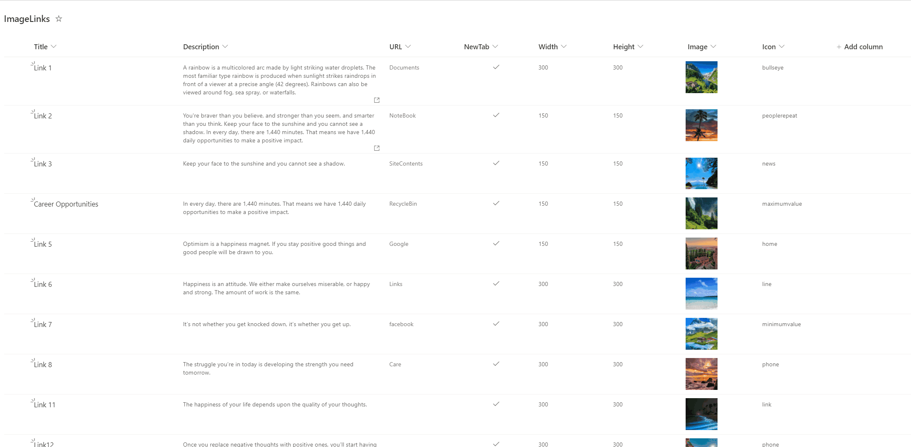

# Image Grid

## Summary

Displays images in a grid layout with customisable height and width. The sample was inspired by the [chevron-shape-format](https://github.com/pnp/List-Formatting/tree/master/view-samples/chevron-shape-format) by [André Lage](https://twitter.com/aaclage).
On click of each post, the link specified by the URL is opened. On hover on each image the description of the image is shown. Optionally an icon is displayed on the top right of the image.

This sample includes two formatting options:

1. **image-grid.json** - Original row formatter for displaying images in a grid layout

> [!CAUTION]
> This sample (image-grid.json) uses the `float` style, which is now [deprecated](https://learn.microsoft.com/sharepoint/dev/declarative-customization/formatting-syntax-reference#style). As a result, it may not work as expected.

2. **Image-grid-horizontally.json** - Tile formatter designed for Gallery view type to display images horizontally

## View requirements

This sample provides two different formatting approaches:

### Option 1: Row Formatter (image-grid.json) - Deprecated
Use this format with standard list views. Note: Due to recent changes in Microsoft Lists, this format may not display images horizontally as expected in some scenarios.

- Apply the formatting using **Format current view** option
- The format expect the following fields:

|Type|Internal Name|Required|Notes|
|---|---|:---:|---|
|Multiple line of text|Description|Yes| |
|Single line of text|Icon|No|Set the icon name for [Fluent UI Icons](https://developer.microsoft.com/fluentui#/styles/web/icons).|
|Hyperlink|URL|Yes| |
|Yes/No|NewTab|No|This field is used to open the link the same tab or new tab.|
|Number|Width|No|If not set, the default width is set to 100px.|
|Number|Height|No|If not set, the default height is set to 100px.|
|Image|Image|Yes||

### Option 2: Tile Formatter (Image-grid-horizontally.json) - Recommended
Use this format with **Gallery** view type for optimal horizontal image display.

- Change the view type to **Gallery**
- Apply the tile formatting using **Format this gallery** option
- Uses fixed dimensions (160px width, 150px height) for consistent display
- The format expect the following fields:

|Type|Internal Name|Required|Notes|
|---|---|:---:|---|
|Multiple line of text|Description|Yes|Displayed in hover card|
|Single line of text|Icon|No|Set the icon name for [Fluent UI Icons](https://developer.microsoft.com/fluentui#/styles/web/icons).|
|Hyperlink|URL|Yes| |
|Yes/No|NewTab|No|This field is used to open the link the same tab or new tab.|
|Image|Image|Yes||

### Technologies Used

* **SharePoint**
* **List** (used to store the image data)
* **View Formatting** (JSON used to style the list into the familiar Instagram output)

### Prerequisites

* You must have a valid SharePoint Online license and permission to create lists.
* You must have a modern SharePoint site where you can store the data for the app.

* Format the view and copy and paste the JSON provided.

## Sample

Solution|Author(s)
--------|---------
image-grid.json | [Reshmee Auckloo](https://github.com/Reshmee011) ([@reshmeeauckloo](https://twitter.com/reshmeeauckloo))
Image-grid-horizontally.json | [Valeras Narbutas](https://github.com/ValerasNarbutas) ([@ValerasNarbutas](https://twitter.com/ValerasNarbutas))

## Version history

Version|Date|Comments
-------|----|--------
1.0|May 20, 2023|Initial release
2.0|July 30, 2025|Updated to include tile formatter for Gallery view type

## Disclaimer

**THIS CODE IS PROVIDED *AS IS* WITHOUT WARRANTY OF ANY KIND, EITHER EXPRESS OR IMPLIED, INCLUDING ANY IMPLIED WARRANTIES OF FITNESS FOR A PARTICULAR PURPOSE, MERCHANTABILITY, OR NON-INFRINGEMENT.**

---

## Additional notes

The following issues and pull request are related to the deprecation of the `float` style:
- [Deprecating float style prop in custom formatter by tpodugu-ms · Pull Request #10169 · SharePoint/sp-dev-docs](https://github.com/SharePoint/sp-dev-docs/pull/10169)
- [List View Formatting - Flex behavior on rowFormatter not functioning row to row · Issue #10008 · SharePoint/sp-dev-docs](https://github.com/SharePoint/sp-dev-docs/issues/10008)
- [Image-grid is not displaying horizontally · Issue #885 · pnp/List-Formatting](https://github.com/pnp/List-Formatting/issues/885)

