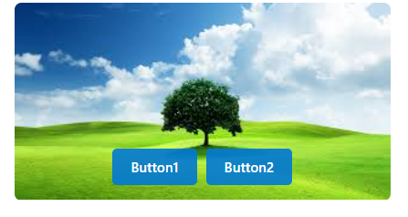

# SharePoint List Formatting - Image with Overlay Buttons

A custom SharePoint list formatting JSON that displays images with overlay buttons in a modern card layout.

## Overview

This formatting creates an attractive card-style view for SharePoint lists containing images with action buttons overlaid on the image. Perfect for galleries, product catalogs, or any list where you need quick actions on visual content.



## Features

- **Image Display**: Full-width responsive images with rounded corners
- **Overlay Buttons**: Two action buttons positioned over the bottom of the image
- **Semi-transparent Design**: Buttons have a glass effect with transparency
- **Responsive Layout**: Adapts to different screen sizes
- **Modern Styling**: Clean, professional appearance with proper spacing
- **External Links**: Buttons can link to any external URL

## Prerequisites

Your SharePoint list must have the following columns:

| Column Name | Type | Description |
|-------------|------|-------------|
| `ImageUrl` | Single line of text or Hyperlink | URL to the image to display |
| `Button1Label` | Single line of text | Text for the first button |
| `Button1Url` | Hyperlink | URL for the first button |
| `Button2Label` | Single line of text | Text for the second button |
| `Button2Url` | Hyperlink | URL for the second button |

## Installation

1. Navigate to your SharePoint list
2. Click on **Format current view** (or the view dropdown → **Format current view**)
3. Select **Tiles** layout if not already selected
4. Click **Format tiles**
5. Copy and paste the JSON code from the formatting file
6. Click **Preview** to see the result
7. Click **Save** to apply the formatting

## Customization Options

### Button Position
Adjust the `margin-top` value in the buttons container to change vertical position:
```json
"margin-top": "-45px"  // Bottom of image (default)
"margin-top": "-120px" // Middle of image
"margin-top": "-200px" // Top of image
```

### Button Colors
Modify the `background-color` property:
```json
"background-color": "rgba(0, 120, 212, 0.9)" // Blue (default)
"background-color": "rgba(76, 175, 80, 0.9)"  // Green
"background-color": "rgba(244, 67, 54, 0.9)"  // Red
```

### Card Size
Adjust the dimensions in the root configuration:
```json
"height": 175,
"width": 350 
```

## Troubleshooting

### Buttons not showing
- Verify all required columns exist and have data
- Check that column names match exactly (case-sensitive)

### Images not displaying
- Ensure image URLs are accessible and valid
- Check if images are blocked by security policies
- Verify the `ImageUrl` column contains proper URLs

### Buttons not clickable
- Ensure `Button1Url` and `Button2Url` columns contain valid URLs
- Check if external links are allowed in your SharePoint environment

## Example Data

Here's sample data for testing:

| ImageUrl| Button1Label | Button1Url | Button2Label | Button2Url |
|----------|--------------|------------|--------------|------------|
| `https://tenant.sharepoint.com/sites/sitename/Documents/image1.jpg`| Button1 | `https://example.com/button1` | Button2 | `https://example.com/button2` |

### Sample

Solution|Author
--------|---------
image-overlay.json | [Sai Bandaru](https://github.com/saiiiiiii) ([LinkedIn](https://www.linkedin.com/in/sai-bandaru-97a946153/))

## Version history

Version|Date|Comments
-------|----|--------
1.0|Sep 04, 2025|Initial release

## Disclaimer
**THIS CODE IS PROVIDED *AS IS* WITHOUT WARRANTY OF ANY KIND, EITHER EXPRESS OR IMPLIED, INCLUDING ANY IMPLIED WARRANTIES OF FITNESS FOR A PARTICULAR PURPOSE, MERCHANTABILITY, OR NON-INFRINGEMENT.**