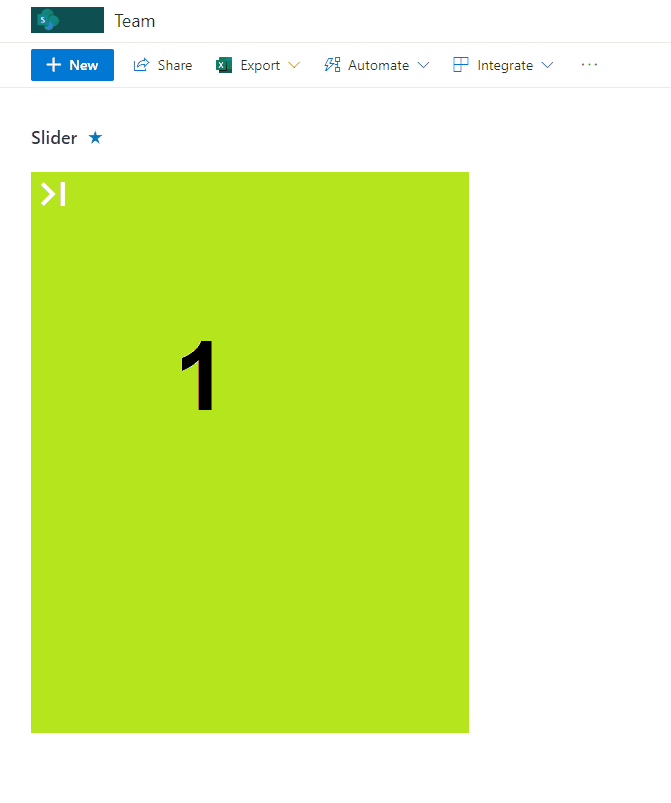

# Image Slider

## Summary
This sample display images as a slider with navigation to the next image.

> The image to display is determined by the `UpdateState` column where the order to display is stored. This is updated by the format for **All** users.

## View requirements
- The format expect the following fields:

Field |Type
--------|---------
Title | Single line of text 
url | Single line of text  - url of image
UpdateState | Single line of text - this field will be used order the images

### Edit View requirements

   - **Sort**: sort by `UpdateState` in ascending order
   - **Item Limit**: Edit the view and set _"Number of items to display"_ to **1** and check option _"Limit the total number of items returned to the specified amount."_

## Sample

Solution|Author(s)
--------|---------
image-slider.json | [André Lage](https://github.com/aaclage)

## Version history

Version|Date|Comments
-------|----|--------
1.0|December 08, 2021|Initial release

## Disclaimer
**THIS CODE IS PROVIDED *AS IS* WITHOUT WARRANTY OF ANY KIND, EITHER EXPRESS OR IMPLIED, INCLUDING ANY IMPLIED WARRANTIES OF FITNESS FOR A PARTICULAR PURPOSE, MERCHANTABILITY, OR NON-INFRINGEMENT.**

