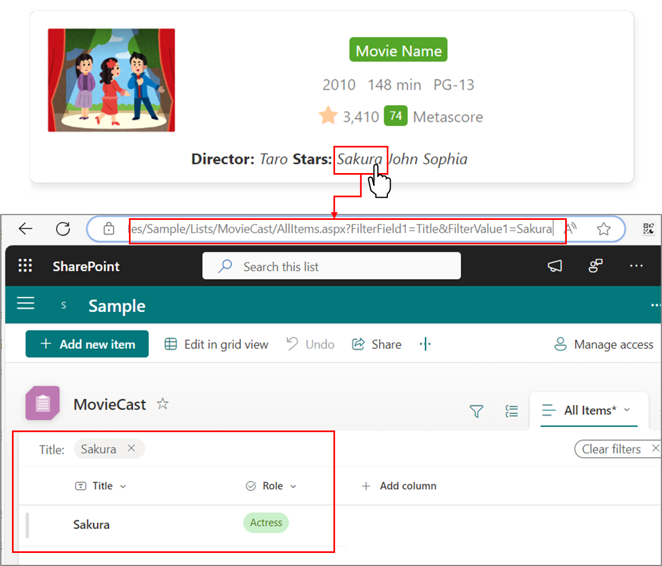

# IMDb Card

## Summary

This sample transforms list items into cards formatted with IMDb (Internet Movie Database) Movie listing layout. To ensure the view functions correctly, make sure all specified columns are included. The icons are referenced from [Fluent UI Icons](https://developer.microsoft.com/en-us/fluentui#/styles/web/icons).


The Director and Actor names are hyperlinks so that you can leverage them to filter other movies where they might have featured. If you set the `href` as follows, the link to the filtered view will be displayed:

```
"href": "=@currentWeb+'/Lists/<<ListName>>'+'/'+'<<ViewName>>.aspx?FilterField1=<<InternalNameOfColumn>>&FilterValue1='+[$<<InternalNameOfColumnToBeUsedForFilter>>]"
```

For example:

```
"href": "=@currentWeb+'/Lists/MovieCast'+'/'+'AllItems.aspx?FilterField1=Title&FilterValue1='+[$Actor1]"
```



You can achieve that by using query strings as described in [this blog](https://sudeepghatak.com/using-hyperlinks-in-list-view-json-to-apply-filters/).

## View requirements

Column Name                 | Type
----------------------------|-----------------------------------------
Title                       | Single line of text
Year                        | Single line of text
Duration                    | Single line of text
Rating                      | Choice (PG,R,A)
VoteCount                   | Number
Metascore                   | Number
Director                    | Single line of text
Actor1                      | Single line of text
Actor2                      | Single line of text
Actor3                      | Single line of text
MovieImage                  | Hyperlink or Picture

## Sample

Solution|Author
--------|---------
imdb-card.json | [Sudeep Ghatak](https://github.com/sudeepghatak) ([LinkedIn](https://www.linkedin.com/in/sudeepghatak/))

## Version history

Version|Date|Comments
-------|----|--------
1.0|July 22, 2024|Initial release

## Disclaimer
**THIS CODE IS PROVIDED *AS IS* WITHOUT WARRANTY OF ANY KIND, EITHER EXPRESS OR IMPLIED, INCLUDING ANY IMPLIED WARRANTIES OF FITNESS FOR A PARTICULAR PURPOSE, MERCHANTABILITY, OR NON-INFRINGEMENT.**

---

## Additional notes

- Query string is also described in the following document:

    [Query String URL Tricks for SharePoint and Microsoft 365 - Filtering and sorting modern SharePoint and Microsoft Lists views](https://learn.microsoft.com/microsoft-365/community/query-string-url-tricks-sharepoint-m365#filtering-and-sorting-modern-sharepoint-and-microsoft-lists-views)

