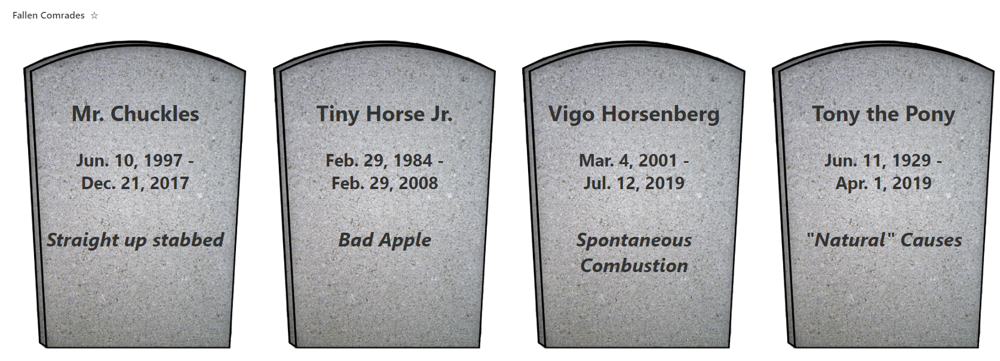

# In Memoriam Tiles

## Summary

This is a silly sample that shows tombstones for items. It demonstrates custom date formatting, custom tiles (gallery) layout, and safe local image referencing.

## View requirements

|Type|Internal Name|Required|
|---|---|:---:|
|Single line of text|Title|Yes|
|Single line of text|Cause|Yes|
|Date/Time|Born|Yes|
|Date/Time|Died|Yes|

## Sample

Solution|Author(s)
--------|---------
in-memoriam-tiles.json | [Chris Kent](https://github.com/thechriskent)

## Version history

Version|Date|Comments
-------|----|--------
1.0|November 12, 2020|Initial release

## Disclaimer

**THIS CODE IS PROVIDED *AS IS* WITHOUT WARRANTY OF ANY KIND, EITHER EXPRESS OR IMPLIED, INCLUDING ANY IMPLIED WARRANTIES OF FITNESS FOR A PARTICULAR PURPOSE, MERCHANTABILITY, OR NON-INFRINGEMENT.**

---

## Additional notes
None

