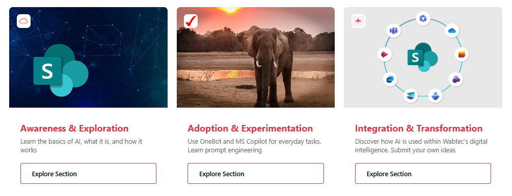

# Interactive Content Card with Explore Button

This sample uses **SharePoint List Formatting** to display list items as **modern card tiles** with a prominent image header, icon overlay, and call-to-action button.  
Each card features a fixed 365x400px layout with an image background, branded icon badge, title/description content area, and an "Explore Section" button that opens external links.

## View Requirements

Create a list with the following columns:

| Internal Name   | Type               | Description |
|-----------------|--------------------|-------------|
| **Title**       | Single line of text| Card title/heading |
| **Description** | Multiple lines of text | Card description/summary |
| **Image**       | Single of text          | Main card background image (upload image siteassets) |
| **IconUrl**     | Single line of text | Small icon for the overlay badge (upload image/url siteassets) |
| **Url**         | Hyperlink          | Target URL for the "Explore Section" button |

## How it Works

- **Image Header**: The main image (`Image` column) serves as a 220px tall background header
- **Icon Overlay**: A circular white badge in the top-left displays the icon from `IconUrl`
- **Content Area**: White content section displays the `Title` in red (#dc3545) and `Description` in gray
- **Action Button**: "Explore Section" button links to the URL specified in the `Url` column
- **Fixed Dimensions**: Each card maintains consistent 365x400px sizing with 20px right margin
- **External Links**: All URLs open in new tabs/windows for better user experience

## Design Features

- **Modern Card Design**: Clean, professional appearance with rounded corners
- **Responsive Layout**: Fixed-width cards that work well in grid arrangements
- **Brand Colors**: Red accent color (#dc3545) for titles and button borders
- **Accessibility**: Proper contrast ratios and semantic HTML structure
- **Interactive Elements**: Hover-friendly button styling

## Sample

Solution|Author
--------|---------
interactive-content-card.json | [Sai Bandaru](https://github.com/saiiiiiii) ([LinkedIn](https://www.linkedin.com/in/sai-bandaru-97a946153/))

## Version history

Version|Date|Comments
-------|----|--------
1.0|September 16, 2025|Initial release

## Disclaimer
**THIS CODE IS PROVIDED *AS IS* WITHOUT WARRANTY OF ANY KIND, EITHER EXPRESS OR IMPLIED, INCLUDING ANY IMPLIED WARRANTIES OF FITNESS FOR A PARTICULAR PURPOSE, MERCHANTABILITY, OR NON-INFRINGEMENT.**

---

## Additional Notes

- **Image Requirements**: Use high-quality images (minimum 365px wide) for best results
- **Icon Format**: PNG or SVG icons work best for the overlay badge (24x24px display size)
- **URL Validation**: Ensure all URLs are properly formatted and accessible
- **Performance**: Consider image optimization for faster loading times
- **Customization**: Modify colors, spacing, and button text in the JSON as needed
- **Mobile Friendly**: Fixed-width design works well on desktop and tablet devices

## Customization Options

You can easily customize this formatter by modifying:
- **Colors**: Change the red accent color (#dc3545) to match your brand
- **Button Text**: Update "Explore Section" to your preferred call-to-action
- **Dimensions**: Adjust card width/height and image header size
- **Border Radius**: Modify the 8px border-radius for different corner styles
- **Spacing**: Adjust padding and margins for tighter or looser layouts