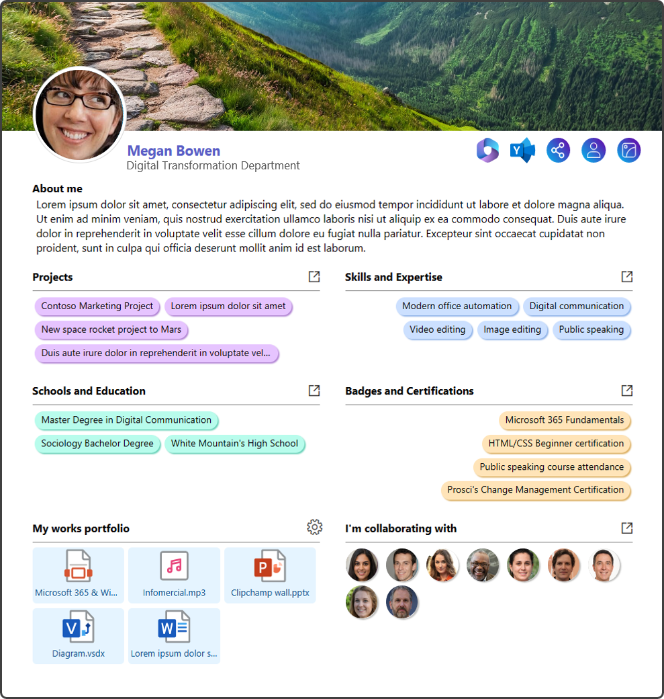

# Internal CV

## Summary
This tutorial will help you create a basic internal CV through view formatting.

## Important notes
This solution is not intended to encompass an entire management process, but should be considered as an additional tool to support a single task or process phase, where users periodically update their respective internal CV.
The final result, including its features, has been tested with the following screen sizes:

**1)** 27" - 2560 X 1440

**2)** 24 inch - 

**3)** 17" - 1920 x 1080

Microsoft Lists mobile app doesn't support the usage of this custom view, whereas an OOTB view would let users to fill out the standard form.

**Solution breakdown**
Here is a visual description of the user interface:

(INSERT SCREENSHOT)

## How to:

**1) LIST CREATION:** create a new list from scratch with the following columns, including their **exact names with capital letters**:

| **COLUMN NAME** | **COLUMN TYPE** |
|:-----------------|-----------------|
| **COVER**       | Image column. This will let users to customize their profile image header             |
| **BACKGROUND**           | Image column. This will let users to add a custom background                |
| **Author**     | This is a standard column, required to display a user name in the internal CV                |
| **YAMMER_PROFILE**            | Multiple lines of text. Rich text **disabled**. This column lets users write their Yammer profile link and make it available through the corresponding command bar icon                |
| **ABOUT_ME**        | Multiple lines of text. Rich text **disabled**. This column allows a user to provide a short description of their working profile and career.                |
| **PROJECTS**   | Multichoice column. This column allows a user to list both past and current projects. You can setup it to contain custom choices or not.                |
| **SKILLS_EXPERTISE**        | Multichoice column. This column allows a user to list skills and expertise considered as relevant.                |
| **SCHOOLS_EDUCATION**        | Multichoice column. This column allows a user to list info about schools and education path.                |
| **BADGES_CERTIFICATIONS**          | Multichoice column. This column allows a user to list all the badges and certification acquired.                |
| **MY_WORKS**        | Multiple lines of text. Rich text **disabled**. This column depends on the OOTB Attachments column and a speficic Power Automate flow to list and display clickable attachments in the internal CV.                 |
| **COWORKERS**   | Multi person column. Altough Microsoft 365 already provides info about most frequent coworkers and an org chart, a user could provide updated and consistent info about **actual** coworkers collaborating in one or more projects.                |

**NOTE:** the standard and well known Title column isn't used in this sample, therefore you can make it not mandatory through the advanced list settings and exclude it both from the view and the standard form.

**2) GALLERY VIEW CREATION:** create a new Gallery view and provide a custom name.

**3) JSON CODE:** copy the JSON code available HERE.

**4) GALLERY VIEW FORMATTING:** paste the JSON code into the view formatting box (Advanced formatting mode):

(INSERT SCREENSHOT)

**5) ADVANCED PERMISSION SETTINGS:** to avoid unexpected and unwanted changes, go to the list settings --> advanced settings and select "Create items and edit items that were created by the user"

**6) VIEW FILTERING:** each user should immediately view only his/her internal CV. To make this work, go to the list settings, scroll down and click on the gallery view you just created. Then, scroll down again to the Filter section, apply and save the following setup:

(INSERT SCREENSHOT)
 
**7) LIST NAME REPLACEMENT:**  go to line number 1422 of the JSON code and replace the dummy text with your real list name, as shown in the image below:

(INSERT SCREENSHOT)

⚠️ **Warning:** the real list name is the one you can find in your browser address bar! Therefore, if you have created a list named "Internal CV", then you have to copy the coded name in the address bar, that is "Internal%20CV".

**8) POWER AUTOMATE FLOW:** to correctly display the attachments as works portfolio, you should setup a specific Power Automate flow as described [here](https://github.com/Fedes365/Microsoft-Lists-Templates/wiki/Custom-attachments-column#power-automate-flow). The service account used to run this flow should be included as list owner in order to override the permission settings illustrated in point n. 5 above.

## More info and details
The image icons displayed on the upper right corner of the toolbar are hosted in this GitHub repository. You can download them and edit the JSON code (eg. row number 226) to display the icons, so that your corporate repository is used as internal source.

## Sample

Solution|Author(s)
--------|---------
internal-cv.json | [Federico Sapia](https://github.com/Fedes365) ([LinkedIn](https://www.linkedin.com/in/federicosapia/))

## Version history

Version |Date              |Comments
--------|------------------|--------------------------------
1.0     |March 4, 2022  |Initial release

## Disclaimer
**THIS CODE IS PROVIDED *AS IS* WITHOUT WARRANTY OF ANY KIND, EITHER EXPRESS OR IMPLIED, INCLUDING ANY IMPLIED WARRANTIES OF FITNESS FOR A PARTICULAR PURPOSE, MERCHANTABILITY, OR NON-INFRINGEMENT.**

