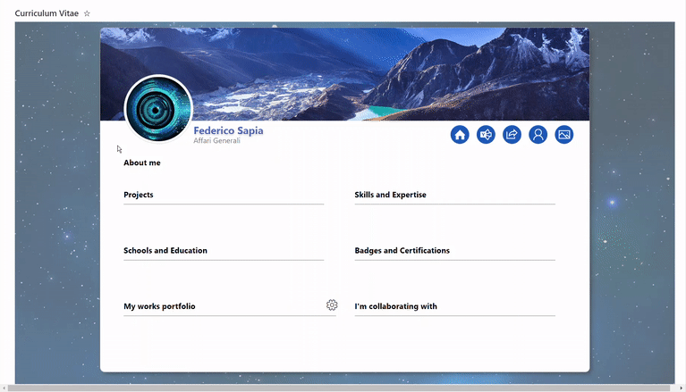

# Internal CV

## Summary
This tutorial will help you create a basic internal CV through JSON view formatting. Thanks to JSON formatting, it's possible to create a large custom card to be used as a form itself, by taking advantage of the [inline editing](https://learn.microsoft.com/sharepoint/dev/declarative-customization/formatting-advanced#inline-editing) feature. Let others know **more about you**, what you're good at, and what you're working on right now. Add projects, skills, and education history to your profile to help others find you when they're looking for people with a **certain expertise**.

## Important notes
This solution is not intended to encompass an entire management process, but it should be considered as an additional tool to support a single task or process phase, where users periodically update their respective internal CV.
The final result, including its features, has been tested with the following screen sizes:

**1)** 27" - 2560 X 1440

**2)** 24" - 1920 x 1080

**3)** 17" - 1920 x 1080

**4)** 17" - 1280 x 1024 (zoom out may be required)

**5)** 13" - 1280 x 800

⚠️ Microsoft Lists mobile app doesn't support the usage of this custom view, whereas an OOTB view would let users to fill out the standard form.

## Solution breakdown

Here is a visual description of the user interface:

## View requirements:

**1) LIST CREATION:** create a new list from scratch with the following columns, including their **exact names with capital letters**:

|**COLUMN NAME**|**COLUMN TYPE**|**ADDITIONAL INFORMATION**|
|---|---|---|
|**COVER**|Image|This will allow a user to customize their profile image header.|
|**BACKGROUND**|Image|This will allow a user to add a custom image background.|
|**Created By**| Person or Group |This is a standard column, required to display a user name in the internal CV. Include this column in your view.|
|**YAMMER_PROFILE**|Multiple lines of text (Rich text **disabled**) |This column allows a user to write his/her Yammer profile link in the standard right pane and make it available to others, through the corresponding toolbar icon.|
|**ABOUT_ME**|Multiple lines of text (Rich text **disabled**)|This column allows a user to provide a short personal description.|
|**PROJECTS**|Multi-Select Choice|This column allows a user to list both past and current projects. List owners (HR personnel) can setup this column to contain custom choices or not.|
|**SKILLS_EXPERTISE**|Multi-Select Choice|This column allows a user to list both skills and expertise. List owners (HR personnel) can setup this column to contain custom choices or not.|
|**SCHOOLS_EDUCATION**|Multi-Select Choice|This column allows a user to list info about his/her schools and education path. Custom choices are recommended.|
|**BADGES_CERTIFICATIONS**|Multi-Select Choice|This column allows a user to list badges and certifications earned. List owners (HR personnel) can setup this column to contain custom choices or not.|
|**MY_WORKS**|Multiple lines of text (Rich text **disabled**)|This column depends on the OOTB Attachments column and a specific Power Automate flow to list and display clickable attachments tiles in the internal CV.|
|**COWORKERS**|Multi-Select Person|Although Microsoft 365 already provides info about related colleagues, a user could provide updated and consistent info about **actual** coworkers he/she is collaborating with.|

**NOTE:** the standard and well known **Title** column isn't used in this sample, therefore you can make it not mandatory through the advanced list settings and exclude it both from the view and the standard right pane form.

**2) GALLERY VIEW CREATION:** create a new Gallery view and provide a custom name.

**3) JSON CODE:** copy the JSON code available [HERE](./internal-cv.json).

**4) GALLERY VIEW FORMATTING:** paste the JSON code into the view formatting box (Advanced formatting mode):

**5) ADVANCED PERMISSION SETTINGS:** an internal CV should only be edited by the user who created it. Therefore, to avoid unexpected and unwanted changes by other users, proper permission settings are highly recommended. Go to the list settings --> advanced settings --> and select "_Create items and edit items that were created by the user_".

**6) VIEW FILTERING FOR A BETTER USER EXPERIENCE:** even if a user can open this list with all the existing items (internal CVs created by others), setting up an already filtered view could be a better option. This behaviour is recommended to allow a user to open his/her internal CV later, without performing a search. To make this work, go to the list settings, scroll down and click on the gallery view you just created. Then, scroll down again to the **Filter** section, apply and save the following setup:

**7) YOUR LIST NAME REPLACEMENT:**  go to line number **1305** and **1328** of the JSON code and replace the dummy text with your real list name, as shown in the sample image below:

⚠️ **Warning:** the real list name is the one you can find in your browser address bar! Therefore, if you have created a list named "Internal CV", then you have to copy the coded name in the address bar, that is "Internal%20CV".

## EMPTY CARD AFTER ITEM CREATION
Since this sample doesn't have any mandatory column, a user can create a new internal CV and save it immediately, without worrying about the standard right pane form. The resulting empty card will be ready to be filled out, thanks to the [inline editing](https://learn.microsoft.com/sharepoint/dev/declarative-customization/formatting-advanced#inline-editing) feature of Microsoft Lists:

## IT'S CLOUDY THERE! CUSTOM HOVERCARD OVERVIEW
Each profile section will expand up to a maximum height. If the number of entries (coloured pills) exceeds the visible space, they will be hidden. In this case, a corresponding hovercard will offer a complete overview as shown in the animated picture below:

## MY WORKS PORTFOLIO AND POWER AUTOMATE FLOW:
To correctly display the attachments as works portfolio, you should setup a specific Power Automate flow. Every time attachments are added, a Power Automate flow will update info into the **MY_WORKS** column previously created and the JSON code will "translate" these info to clickable tiles, thanks to the split operator. Furthermore, a service account used to run this flow should be included as **list owner** in order to override the permission settings illustrated in point n. 5 above.

**HOW IT WORKS**

A Power Automate flow uses a service account (or a personal account not meant for actual use of this solution) to check if one or more attachments are added to an item. This flow is triggered every time a new item is created or modified by other users.

If you are not familiar with Power Automate or your organization has some limitations about performing such operation, you can still take advantage of the works portfolio section! Since these attachments wouldn't be updated everyday, you could provide your users with a basic training to make them manually write the attachments names, separated by colon. For example:  **Hello world.docx:Presentation.pptx:Table.xlsx** would return 3 clickable tiles in the works portfolio section.

Here is an overview of the Power Automate flow:

**HOW TO AVOID INFINITE LOOPS**

If a Power Automate account updates an item with all its attachments labels, then the trigger will run again, given that the item has been modified. This behaviour would lead to an infinite loop, just because the service account is doing what we setup!

How to prevent this unwanted behaviour?

As explained in a tutorial made by [Reza Dorrani](https://www.youtube.com/watch?v=oKN4_5o2NUA), you have to setup a trigger condition. In this tutorial, the trigger condition checks if the item has been modified by a service account used to run the flow. If yes, the trigger condition will automatically stop the flow, then avoiding infinite loops.

## More info and details

💡 You can find out more about the split operator in a [detailed article](https://michelcarlo.com/2022/09/10/two-approaches-to-replace-all-occurrences-of-a-value-in-a-string-using-sharepoint-list-formatting-replaceall-split-join/) written by [**Michel Mendes**](https://github.com/michelcarlo) and an [amazing implementation](https://github.com/pnp/List-Formatting/tree/master/column-samples/number-zero-to-ten-rating) shared by [**Tetsuya Kawahara**](https://github.com/tecchan1107).

## Sample

Solution|Author(s)
--------|---------
internal-cv.json | [Federico Sapia](https://github.com/Fedes365)

## Version history

Version |Date              |Comments
--------|------------------|--------------------------------
1.0     |December 21, 2022  |Initial release

## Disclaimer
**THIS CODE IS PROVIDED *AS IS* WITHOUT WARRANTY OF ANY KIND, EITHER EXPRESS OR IMPLIED, INCLUDING ANY IMPLIED WARRANTIES OF FITNESS FOR A PARTICULAR PURPOSE, MERCHANTABILITY, OR NON-INFRINGEMENT.**

