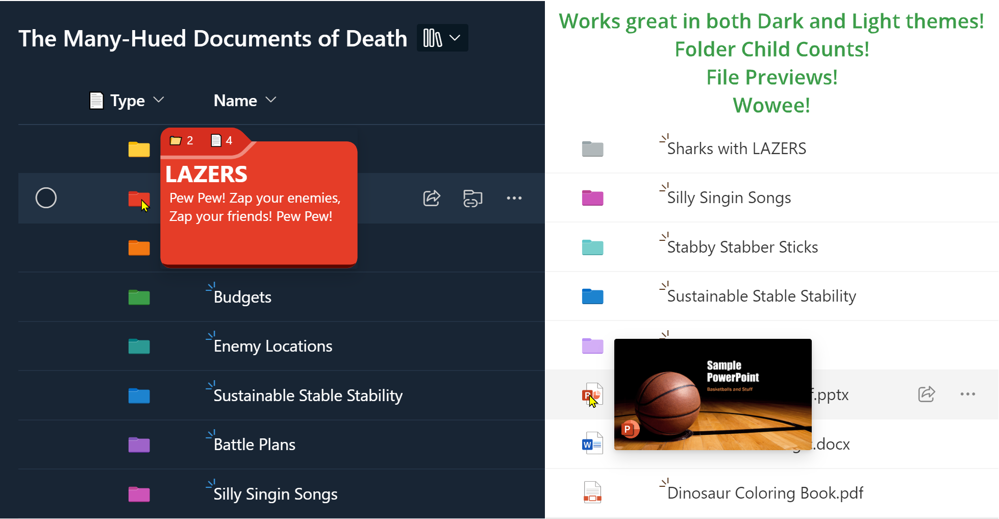

# Issue Tracker Enhanced

## Summary
This sample demonstrates customizing an out of the box list template, Issue Tracker. Some guidance around columns, forms, and additional column formats provide several small enhancements. Additionally, starter json files are provided to make customizing group headers and form bodies simpler. Finally, a board format demonstrates creating a custom card and making the issue tracker even easier to use.

## View requirements

The included formats are intended to be used with the "Issue Tracker" Microsoft list template. Creating a list from that template will provide all of the following columns:

|Type|Display Name|Internal Name|Required|
|---|---|---|:---:|
|Single line of text|Issue|Title|No|
|Multi-line text|Issue description|Description|No|
|Choice|Priority|Priority|No|
|Choice|Status|Status|No|
|Person|Assgined to|Assignedto0|No|
|Date/Time|Date reported|DateReported|No|
|Hyperlink|Issue source|ImageSource|No|
|Image|Images|Images|No|
|Person|Issue logged by|Issueloggedby|No|

### List Cleanup

These steps are **not** required, but will make your Issue Tracker a littler easier to use (and help it match the screenshots). You can use the column menu > `Edit` to change settings for the following fields:

- **Issue** (Title)
    - Required: Yes
- **Issue description**
    - Required: Yes
- **Priority**
    - Required: Yes
    - Default value: `Normal`
- **Status**
    - Required: Yes
    - Disable "Add value manually"
- **Date reported**
    - Default value: Today
- **Images**
    - Rename to `Image`
    - Change description to "Photo or image of the issue"

## Sample

Solution|Author(s)
--------|---------
issue-tracker-enhanced.json | [Chris Kent](https://github.com/thechriskent) ([@thechriskent](https://twitter.com/thechriskent))
issue-tracker-enhanced.json | [Chris Kent](https://github.com/thechriskent) ([@thechriskent](https://twitter.com/thechriskent))
issue-tracker-enhanced.json | [Chris Kent](https://github.com/thechriskent) ([@thechriskent](https://twitter.com/thechriskent))
issue-tracker-enhanced.json | [Chris Kent](https://github.com/thechriskent) ([@thechriskent](https://twitter.com/thechriskent))
issue-tracker-enhanced.json | [Chris Kent](https://github.com/thechriskent) ([@thechriskent](https://twitter.com/thechriskent))
issue-tracker-enhanced.json | [Chris Kent](https://github.com/thechriskent) ([@thechriskent](https://twitter.com/thechriskent))
issue-tracker-enhanced.json | [Chris Kent](https://github.com/thechriskent) ([@thechriskent](https://twitter.com/thechriskent))
issue-tracker-enhanced.json | [Chris Kent](https://github.com/thechriskent) ([@thechriskent](https://twitter.com/thechriskent))
issue-tracker-enhanced.json | [Chris Kent](https://github.com/thechriskent) ([@thechriskent](https://twitter.com/thechriskent))
issue-tracker-enhanced.json | [Chris Kent](https://github.com/thechriskent) ([@thechriskent](https://twitter.com/thechriskent))
issue-tracker-enhanced.json | [Chris Kent](https://github.com/thechriskent) ([@thechriskent](https://twitter.com/thechriskent))

## Version history

Version|Date|Comments
-------|----|--------
1.0|November 23, 2023|Initial release

## Disclaimer
**THIS CODE IS PROVIDED *AS IS* WITHOUT WARRANTY OF ANY KIND, EITHER EXPRESS OR IMPLIED, INCLUDING ANY IMPLIED WARRANTIES OF FITNESS FOR A PARTICULAR PURPOSE, MERCHANTABILITY, OR NON-INFRINGEMENT.**

---

## Additional notes

- [Use column formatting to customize SharePoint](https://docs.microsoft.com/en-us/sharepoint/dev/declarative-customization/column-formatting)

