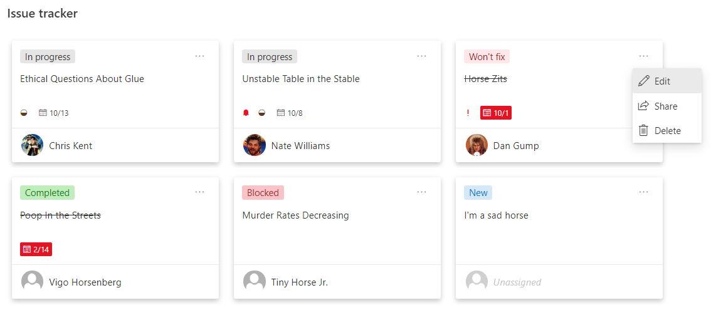

# Issue Tracker: Planner Cards

## Summary
This sample is intended to be used in combination with the Issue Tracker list template. The format keeps the row highlighting for blocked issues but also adds a Tiles view that provides a Microsoft Planner look and feel.

## View requirements

Adding a new list using the Issue Tracker template will provide all the fields required. But the fields used are listed below for reference.

|Type|Internal Name|Required|
|---|---|:---:|
|Date|Died|Yes|

## Sample

Solution|Author(s)
--------|---------
issue-tracker-planner-cards | [Chris Kent](https://twitter.com/thechriskent)

## Version history

Version|Date|Comments
-------|----|--------
1.0|October 15, 2020|Initial release

## Disclaimer
**THIS CODE IS PROVIDED *AS IS* WITHOUT WARRANTY OF ANY KIND, EITHER EXPRESS OR IMPLIED, INCLUDING ANY IMPLIED WARRANTIES OF FITNESS FOR A PARTICULAR PURPOSE, MERCHANTABILITY, OR NON-INFRINGEMENT.**

---

