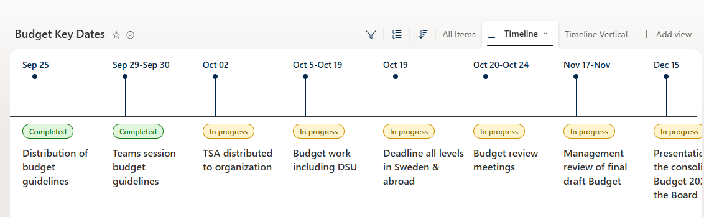

# Key Dates Timeline

## Summary

Beautiful horizontal timeline view for budget key dates/milestones. Shows status badges, milestone titles with hover cards containing descriptions and "Learn more" links.

## View requirements

This sample works with any list that has the following columns:

- **Title** (Single line of text) – Date label (e.g. "Sep 25")
- **Status** (Choice) – Values: `Completed`, `In progress`
- **Milestone** (Single line of text or Multi-line) – Milestone title
- **Description** (Multi-line text) – Details shown in hover card
- **Link** (Hyperlink) – Optional link for "Learn more"

## Sample

| Solution                        | Author(s)          |
|---------------------------------|--------------------|
| key-dates-timeline.json  | [Anand](https://github.com/anandragav) |

## Version history

| Version | Date          | Comments              |
|---------|---------------|-----------------------|
| 1.0     | July 20, 2026 | Initial release       |

## Disclaimer

**THIS CODE IS PROVIDED AS IS WITHOUT WARRANTY OF ANY KIND, EITHER EXPRESS OR IMPLIED, INCLUDING ANY IMPLIED WARRANTIES OF FITNESS FOR A PARTICULAR PURPOSE, MERCHANTABILITY, OR NON-INFRINGEMENT.**

---
