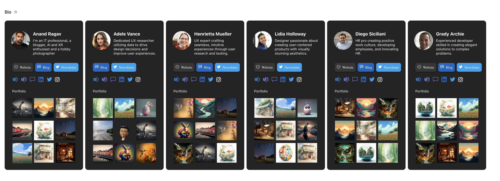

# Linkinbio Instagram

## Summary

This sample creates a instagram-inspired bio page for users.A "Link in bio" page is important for people to have because it provides a centralized location where they can direct their followers or potential customers to access more information about them, their products, or their services.

## View requirements

|Type|Internal Name|Required|Notes|
|---|---|:---:|---|
|Person|Person|Yes||
|Multi lines of text|Bio|Yes||
|Hyperlink|Website|No||
|Hyperlink|Blog|No||
|Hyperlink|Newsletter|No||
|Hyperlink|VivaEngage|No||
|Hyperlink|TeamsCall|No|Deep link to call a person in Teams, refer MS Docs.|
|Hyperlink|TeamsChat|No|Deep link to chat with a person in Teams, refer MS Docs.|
|Hyperlink|LinkedIn|No||
|Hyperlink|X|No||
|Hyperlink|Instagram|No||
|Choices|Portfolio|Yes|"Yes", "No"|
|Image|Photo1|No||
|Image|Photo2|No||
|Image|Photo3|No||
|Image|Photo4|No||
|Image|Photo5|No||
|Image|Photo6|No||
|Image|Photo7|No||
|Image|Photo8|No||
|Image|Photo9|No||

- You need to use the Gallery or Tiles layout.

## Sample

Solution|Author(s)
--------|---------
linkinbio-instagram.json | [Anand Ragav](https://github.com/anandragav)

## Version history

Version|Date|Comments
-------|----|--------
1.0|April 22, 2023|Initial release

## Disclaimer

**THIS CODE IS PROVIDED *AS IS* WITHOUT WARRANTY OF ANY KIND, EITHER EXPRESS OR IMPLIED, INCLUDING ANY IMPLIED WARRANTIES OF FITNESS FOR A PARTICULAR PURPOSE, MERCHANTABILITY, OR NON-INFRINGEMENT.**

---

## Additional notes

- None

