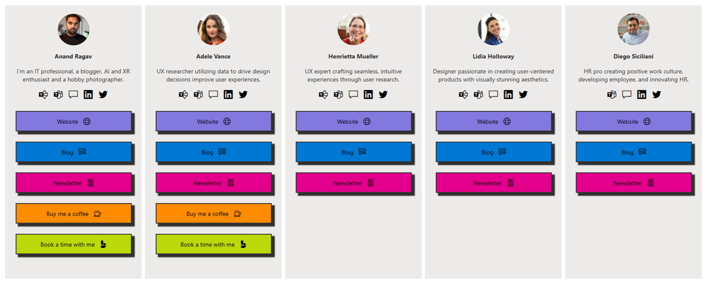

# Linkinbio

## Summary

This sample creates a link in bio card for users. A "Link in bio" is important for people to have because it provides a centralized location where they can direct their followers or potential customers to access more information about them, their products, or their services.

## View requirements

|Type|Internal Name|Required|Notes|
|---|---|:---:|---|
|Person|Person|Yes||
|Multi lines of text|Bio|Yes||
|Hyperlink|Yammer|No||
|Hyperlink|TeamsCall|No|Set up a [deep link to call a person in Teams](https://learn.microsoft.com/microsoftteams/platform/concepts/build-and-test/deep-link-workflow?tabs=teamsjs-v2#deep-link-to-start-an-audio-video-call-with-users).|
|Hyperlink|TeamsChat|No|Set up a [deep link to chat with a person in Teams](https://learn.microsoft.com/microsoftteams/platform/concepts/build-and-test/deep-link-workflow?tabs=teamsjs-v2#deep-link-to-start-a-new-chat).|
|Hyperlink|LinkedIn|No||
|Hyperlink|Twitter|No||
|Hyperlink|Website|No||
|Hyperlink|Blog|No||
|Hyperlink|Newsletter|No||
|Hyperlink|Coffee|No||
|Hyperlink|Bookings|No||

- You need to use the Gallery layout.

## Sample

Solution|Author(s)
--------|---------
linkinbio.json | [Anand Ragav](https://github.com/anandragav) ([@anandVragav](https://twitter.com/anandVragav))

## Version history

Version|Date|Comments
-------|----|--------
1.0|April 22, 2023|Initial release

## Disclaimer

**THIS CODE IS PROVIDED *AS IS* WITHOUT WARRANTY OF ANY KIND, EITHER EXPRESS OR IMPLIED, INCLUDING ANY IMPLIED WARRANTIES OF FITNESS FOR A PARTICULAR PURPOSE, MERCHANTABILITY, OR NON-INFRINGEMENT.**

---

## Additional notes

- None

