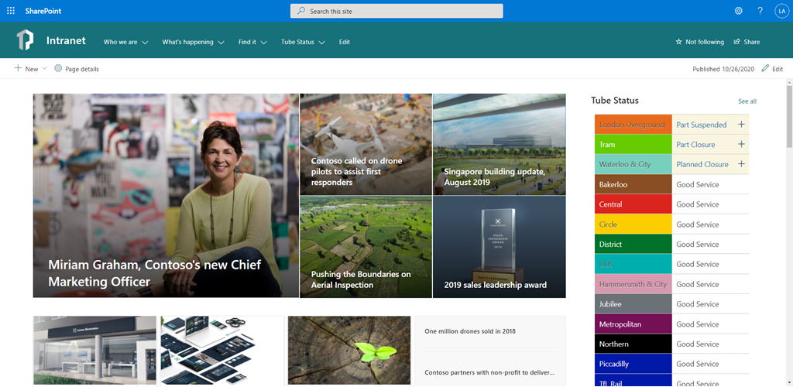
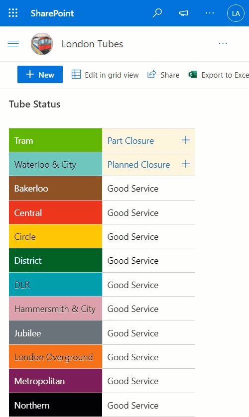

# London Underground Line Status

Display on the homepage of your SharePoint intranet a continually updated feed of London Underground line statuses using the publicly available Transport for London (TFL) API. The results are retrieved using Power Automate, then written to a SharePoint list, and the list view is styled (using view formatting) so it looks like the familiar TFL tube status board with correct line colours. Any line not currently in Good service can be clicked and a hovercard will show with further information i.e. delays/suspension/closure etc. 

### Technologies Used

* **SharePoint** 
  * **List** (used to store the latest TFL line status data)
    * **View Formatting** (JSON used to style the list into the familiar TFL Status board)
* **Power Automate** (used for both creating the Tube Status SharePoint list using the SharePoint REST API and then, on a scheduled basis, retrieving the latest TFL tube statuses)

### Prerequisites

* You must be licenced and able to create Power Automate flows
* You must have a valid SharePoint Online license and permission to create lists.
* You must have a modern SharePoint site where you can store the data for the app.
* Download the assets from this folder

## How To Install The Solution

I have attempted to simplify/automate the deployment of the solution as much as possible. I have combined this into two flow templates which with a few very minor changes do all the work for you to deploy and configure this solution!

It is a very quick install and will take you approximately 15 minutes.

> No need to create the list manually, run any PowerShell to execute any commands, apply a PnP Template or Site Design, etc.

An overview is provided below, but detailed installation instructions can be found here:
[Live London Underground Line Status - SharePoint View Formatting & Power Automate](https://www.leonarmston.com/2020/09/live-london-underground-line-status-sharepoint-view-formatting-power-automate/)

There are 2 Power Automate flow templates included in the Assets folder in this solution. Download both of the zip files to your machine.

### Deployment flow

- In PowerAutomate, import the [DeploySPList-LondonTubes.zip](./flows/DeploySPList-LondonTubes.zip) template.
- Once imported, edit the flow to change the Target Site for Lists variable to point to the site where you would like the Tube Status list to be deployed.
- Run the flow
- You can now safely remove this flow as it was only needed once to create the list and install the view format

### TFL Tube Status flow

- In PowerAutomate, import the [LondonTubes-TFLTubeStatusAPI.zip](./flows/LondonTubes-TFLTubeStatusAPI.zip) template.
- **You will receive an error** (_import failed for one or more package resources_)
- Click the **Save as a new flow** link within the error section
- Use the flow checker to find each action that needs to be updated (there are 3 total). Update the action to point to your site and choose the Tube Status list.
- Save the flow and Run it

Head over to your list and you'll see the Tube Statuses being updated using the view format! By default, this list will receive updates every 15 minutes.

## Sample

Solution|Author(s)
--------|---------
DeploySPList-LondonTubes.zip | [Leon Armston @LeonArmston](https://twitter.com/LeonArmston)
LondonTubes-TFLTubeStatusAPI.zip  | [Leon Armston @LeonArmston](https://twitter.com/LeonArmston)
LondonTubes | [Leon Armston @LeonArmston](https://twitter.com/LeonArmston)

## Version history

Version|Date|Comments
-------|----|--------
1.0|October 24, 2020|Initial release

## Disclaimer
**THIS CODE IS PROVIDED *AS IS* WITHOUT WARRANTY OF ANY KIND, EITHER EXPRESS OR IMPLIED, INCLUDING ANY IMPLIED WARRANTIES OF FITNESS FOR A PARTICULAR PURPOSE, MERCHANTABILITY, OR NON-INFRINGEMENT.**

