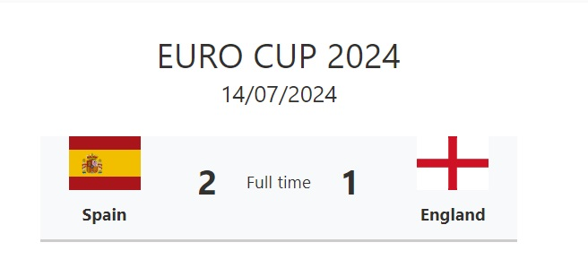

# Match Score Card

## Summary

This sample transforms list items into a match summary. The flag icons are referenced from the following [Github project](https://github.com/lipis/flag-icons). The columns listed below must be included in the list view.

## View requirements

Column Name                 | Type
----------------------------|-----------------------------------------
Title                       | Single line of text
Country1                    | Single line of text
Country1Score               | Single line of text
Country2                    | Single line of text
Country2Score               | Single line of text
MatchDate                   | Date and Time
Country1FlagUrl             | Single line of text
Country2FlagUrl             | Single line of text

> [!NOTE]  
> If images from external sites are specified for `Country1FlagUrl` and `Country2FlagUrl`, HTML field security must be set. For more information see: [Allow or restrict the ability to embed content on SharePoint pages](https://support.microsoft.com/office/allow-or-restrict-the-ability-to-embed-content-on-sharepoint-pages-e7baf83f-09d0-4bd1-9058-4aa483ee137b).

## Sample

Solution|Author
--------|---------
match-score-card.json | [Sudeep Ghatak](https://github.com/sudeepghatak)

## Version history

Version|Date|Comments
-------|----|--------
1.0|July 26, 2024|Initial release

## Disclaimer
**THIS CODE IS PROVIDED *AS IS* WITHOUT WARRANTY OF ANY KIND, EITHER EXPRESS OR IMPLIED, INCLUDING ANY IMPLIED WARRANTIES OF FITNESS FOR A PARTICULAR PURPOSE, MERCHANTABILITY, OR NON-INFRINGEMENT.**

---

## Additional notes

None

