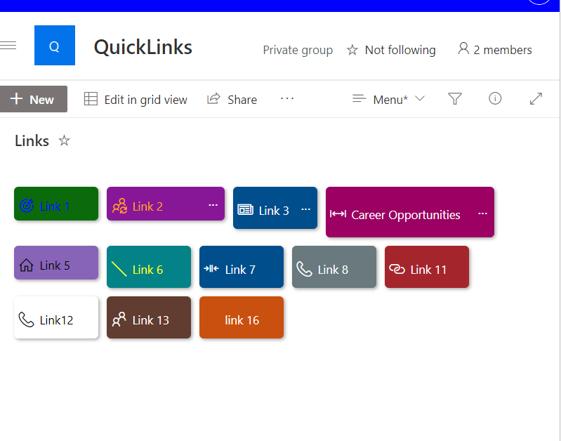
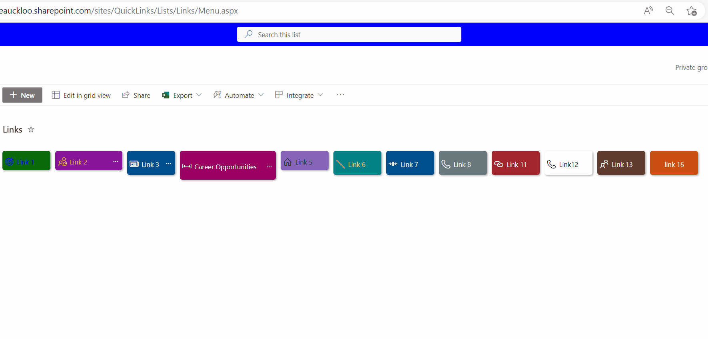

# Menu Link Button

## Summary

This sample has been inspired by [menu-link-tiles](https://github.com/pnp/List-Formatting/tree/master/view-samples/menu-link-tiles) by [André Lage](https://twitter.com/aaclage). It includes a Button style menu similar to Quick Links Button style with additional features such as using **width** , **height**, **color** and **fontColor**, and also includes `customCardProps` to show a custom hover card with the **description** of a tile.

> The sample is responsive.  

## View requirements

- The format expect the following fields:

Field |Type
--------|---------
Title | Single line of text
Description | Multiple line of text
Color | Single line of text - Select one of this pre defined case-sensitive colors - (**empty/null, Green, Red, Cyan, CyanBlue, Gray, MagentaPink, BlueMagenta, Orange, OrangeYellow, RedOrange**).
icon | Single line of text
URL | Hyperlink
NewTab | Yes/No - This field is used to open the link the same tab or new tab
Width | Number - If not set, the default width is set to 100px.
Height | Number - If not set, the default width is set to 40px.
FontColor | If not set, set the default to white

### Edit View requirements

- Sort by the `Modified` column in descending order

## Sample

Solution|Author(s)
--------|---------
menu-link-button.json | [Reshmee Auckloo](https://github.com/reshmee011) ([@reshmeeauckloo](https://twitter.com/reshmeeauckloo))

## Version history

Version|Date|Comments
-------|----|--------
1.0|May 03, 2023|Initial release

## Disclaimer

**THIS CODE IS PROVIDED *AS IS* WITHOUT WARRANTY OF ANY KIND, EITHER EXPRESS OR IMPLIED, INCLUDING ANY IMPLIED WARRANTIES OF FITNESS FOR A PARTICULAR PURPOSE, MERCHANTABILITY, OR NON-INFRINGEMENT.**

