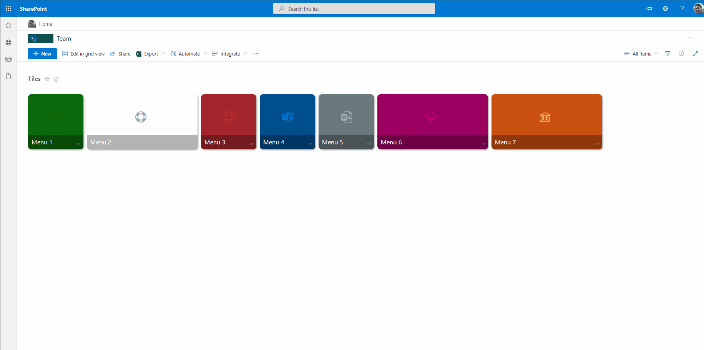
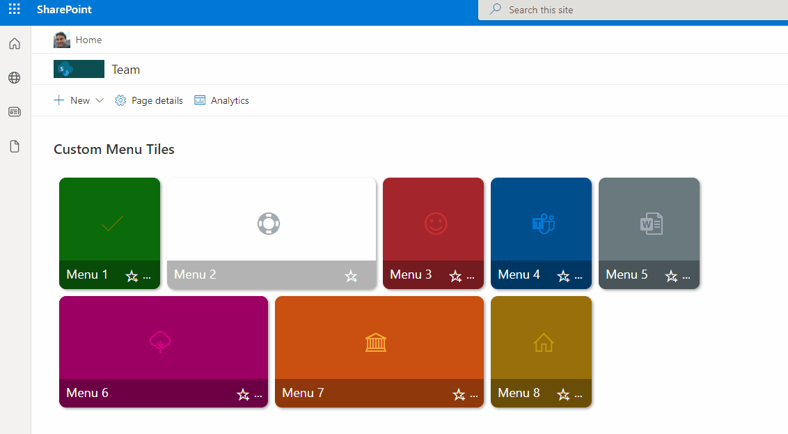

# Menu Link Tiles

## Summary
This sample includes a Metro tiles style menu with additional features such us configuration of tiles using **size** and **color**, option to **favorite** a tile using `setValue`, and also includes `customCardProps` to show a custom hover card with the **description** of a tile.

> This format uses the icon `AddFavorite` combined with `"action": "setValue"` to update an item and reorganizes Tiles in the view when ordered by `Modified`. 

## View requirements
- The format expect the following fields:

Field |Type
--------|---------
Title | Single line of text 
Description | Multiple line of text 
Color | Single line of text - Select one of this pre defined case-sensitive colors - (**empty/null, Green, Red, CyanBlue, Gray, MagentaPink, Orange, OrangeYellow**).
icon | Single line of text
URL | Hyperlink 
NewTab | Yes/No - This field is used to open the link the same tab or new tab
Small | Yes/No - Used to define the size of Tile.
OrderDate | Date & Time - this field will be used to update item to order tile.

### Edit View requirements

- Sort by the `Modified` column in descending order

## Sample

Solution|Author(s)
--------|---------
menu-link-tiles.json | [André Lage](https://github.com/aaclage)

## Version history

Version|Date|Comments
-------|----|--------
1.0|December 03, 2021|Initial release

## Disclaimer
**THIS CODE IS PROVIDED *AS IS* WITHOUT WARRANTY OF ANY KIND, EITHER EXPRESS OR IMPLIED, INCLUDING ANY IMPLIED WARRANTIES OF FITNESS FOR A PARTICULAR PURPOSE, MERCHANTABILITY, OR NON-INFRINGEMENT.**

