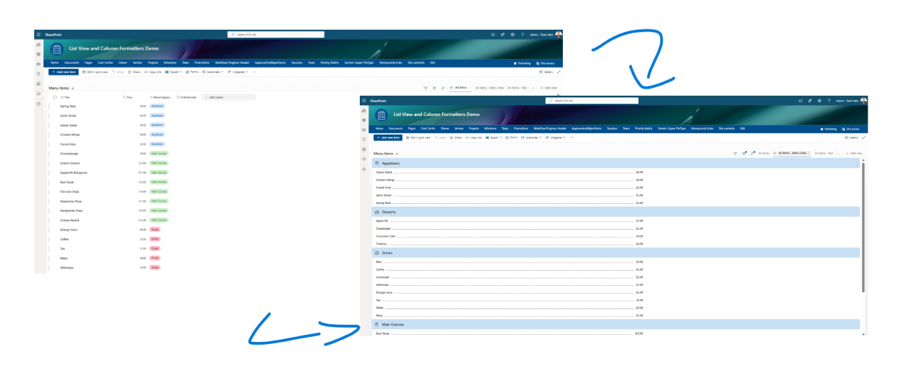
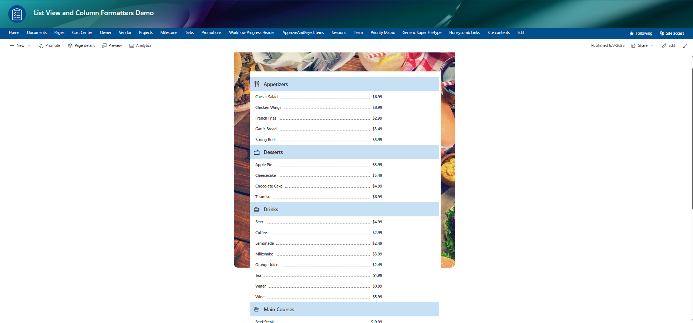

# Menu Style List

## Summary  
This sample transforms SharePoint list items into a styled menu layout using list view formatting. Each row is automatically formatted to visually separate the item name and price, mimicking a clean, restaurant-style pricing table - perfect for food menus, service lists, or product offerings.

  



**Note:** To customise group icons (e.g. for `MainCategory`), edit the `iconName` attribute in the JSON (around line 42).  

```json
"attributes": {
  "iconName": "=if(@group.fieldData.displayValue == 'Appetizers', 'EatDrink', if(@group.fieldData.displayValue == 'Drinks', 'CoffeeScript', if(@group.fieldData.displayValue == 'Desserts', 'Cake', if(@group.fieldData.displayValue == 'Main Courses', 'Chopsticks', ''))))"
}
```

## View requirements
|Type               |Internal Name|Required|
|-------------------|-------------|:------:|
|Single line of text|Title        |Yes     |
|Number             |Price       |Yes     |
|Choice |MainCategory   |Yes        |

- Make sure to use the List View and include all the specified fields in the view.
- To customize the menu order, add a sorting column (e.g., `OrderNumber`) and use it as the sort field in the view.

## Sample

Solution|Author(s)
--------|---------
menu-style-list.json | [Tanel Vahk](https://github.com/tvahk)

## Version history

Version |Date             |Comments
--------|-----------------|--------------------------------
1.0     |June 3, 2025 |Initial release

## Disclaimer
**THIS CODE IS PROVIDED *AS IS* WITHOUT WARRANTY OF ANY KIND, EITHER EXPRESS OR IMPLIED, INCLUDING ANY IMPLIED WARRANTIES OF FITNESS FOR A PARTICULAR PURPOSE, MERCHANTABILITY, OR NON-INFRINGEMENT.**

