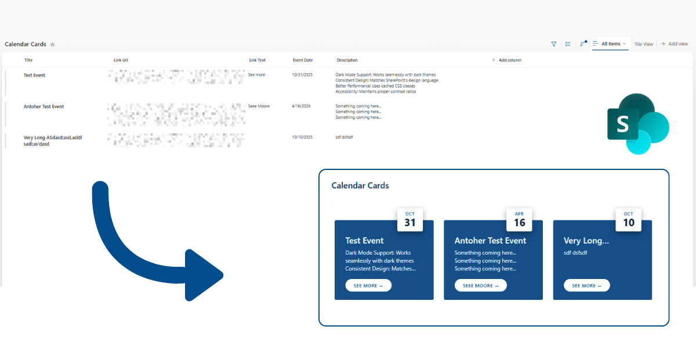

# Modern Event Cards

## Summary
This sample turns list items into modern event cards with calendar-style date badges. Each card shows the event date with the month and day number in a nice visual format. The cards also display the event title, description, and an optional link button.

The date badge floats on top of each card with a shadow effect, making it easy to see important dates at a glance. The formatter automatically formats dates from your EventDate field.

## View requirements
|Type               |Internal Name|Required|
|-------------------|-------------|:------:|
|Single line of text|Title        |Yes     |
|Multiple lines of text|Description  |Yes     |
|Date and Time      |EventDate    |Yes     |
|Hyperlink or Picture|LinkUrl      |No      |
|Single line of text|LinkText     |No      |

- Use the **Gallery View** (Tiles layout)
- Include all required fields in your view

## Sample

Solution|Author(s)
--------|---------
modern-event-cards.json | [Tanel Vahk](https://github.com/tvahk)

## Version history

Version |Date             |Comments
--------|-----------------|--------------------------------
1.0     |October 20, 2025 |Initial release

## Disclaimer
**THIS CODE IS PROVIDED *AS IS* WITHOUT WARRANTY OF ANY KIND, EITHER EXPRESS OR IMPLIED, INCLUDING ANY IMPLIED WARRANTIES OF FITNESS FOR A PARTICULAR PURPOSE, MERCHANTABILITY, OR NON-INFRINGEMENT.**

