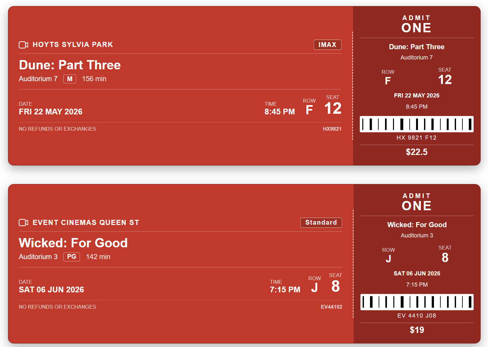

# Movie Ticket Stub

## Summary

This SharePoint JSON view formatting sample transforms list items into realistic movie ticket stubs. Each card mimics a printed cinema ticket with a main section (movie title, cinema, format, date, time, row and seat) and a tear-off stub (ADMIT ONE block, ticket number, barcode and price) separated by a dashed perforation. 

## View requirements

### Recommended SharePoint List Columns

| Column Name      | Internal Name   | Type                | Description                                                       |
| ---------------- | --------------- | ------------------- | ----------------------------------------------------------------- |
| Title            | Title           | Single line of text | Movie title (e.g. Dune: Part Three)                               |
| Cinema           | Cinema          | Single line of text | Cinema or chain name (e.g. Hoyts Sylvia Park)                     |
| Auditorium       | Auditorium      | Single line of text | Auditorium or screen identifier (e.g. Auditorium 7)               |
| Format           | Format          | Choice              | Screen format (Standard, IMAX, 3D, Dolby Atmos, Recliner, 4DX)    |
| Rating           | Rating          | Choice              | Classification (G, PG, M, R13, R16, R18)                          |
| Runtime          | Runtime         | Number              | Runtime in minutes (e.g. 156)                                     |
| Show Date        | ShowDate        | Single line of text | Show date formatted as `DDD DD MMM YYYY` (e.g. `FRI 22 MAY 2026`) |
| Show Time        | ShowTime        | Single line of text | Show time (e.g. `8:45 PM`)                                        |
| Row              | Row             | Single line of text | Seat row letter (e.g. `F`)                                        |
| Seat             | Seat            | Single line of text | Seat number (e.g. `12`)                                           |
| Booking Ref      | BookingRef      | Single line of text | Booking reference / order number (e.g. `HX9821`)                  |
| Ticket Number    | TicketNumber    | Single line of text | Ticket serial number printed under the barcode                    |
| Price            | Price           | Number              | Ticket price (e.g. `22.50`)                                       |

A PowerShell script has been provided in the [assets](./assets/Create%20List.ps1) folder to provision the list for you.

**Note:** This script uses [PnP PowerShell](https://pnp.github.io/powershell/) and requires an environment ready for PnP PowerShell.

## Sample

Solution|Author
--------|---------
movie-ticket-stub.json | [Sudeep Ghatak](https://github.com/sudeepghatak) ([LinkedIn](https://www.linkedin.com/in/sudeepghatak/))

## Version history

Version|Date|Comments
-------|----|--------
1.0|May 11, 2026|Initial release

## Disclaimer

**THIS CODE IS PROVIDED *AS IS* WITHOUT WARRANTY OF ANY KIND, EITHER EXPRESS OR IMPLIED, INCLUDING ANY IMPLIED WARRANTIES OF FITNESS FOR A PARTICULAR PURPOSE, MERCHANTABILITY, OR NON-INFRINGEMENT.**

---

## Additional notes

- The **Title** column is used as the movie title and is shown both on the main ticket and on the stub.
- **ShowDate** is stored as text in `DDD DD MMM YYYY` format (e.g. `FRI 22 MAY 2026`) to match the look of a printed cinema ticket. If you prefer to use a real Date column, replace the `[$ShowDate]` references with a calculated text column or with a `toLocaleDateString` expression.
- The barcode is painted with a `repeating-linear-gradient` background — no image asset is required.
- The price renders only when greater than zero. Leave **Price** blank or zero to hide it.
- The "NO REFUNDS OR EXCHANGES" footer message is static and always displayed.

