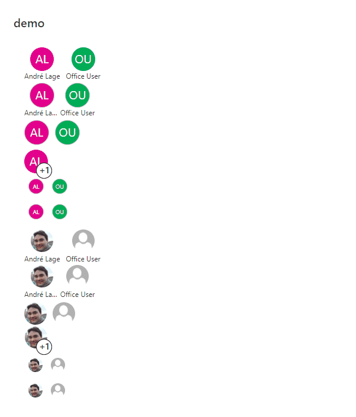

# Multi-Person Displays

## Summary
This sample provides multiple formats illustrating different ways multi-person field display and inline editing can occur. The field is rendered multiple times to show different options.

## View requirements
- The format expect the following fields:

Field |Type
--------|---------
PersonChat | Person - check to yes, Allow multiple selections

## Sample

Solution|Author(s)
--------|---------
multi-person-displays.json | [André Lage](https://github.com/aaclage)

## Version history

Version|Date|Comments
-------|----|--------
1.0|January 04, 2022|Initial release

## Disclaimer
**THIS CODE IS PROVIDED *AS IS* WITHOUT WARRANTY OF ANY KIND, EITHER EXPRESS OR IMPLIED, INCLUDING ANY IMPLIED WARRANTIES OF FITNESS FOR A PARTICULAR PURPOSE, MERCHANTABILITY, OR NON-INFRINGEMENT.**

---

## Additional notes

