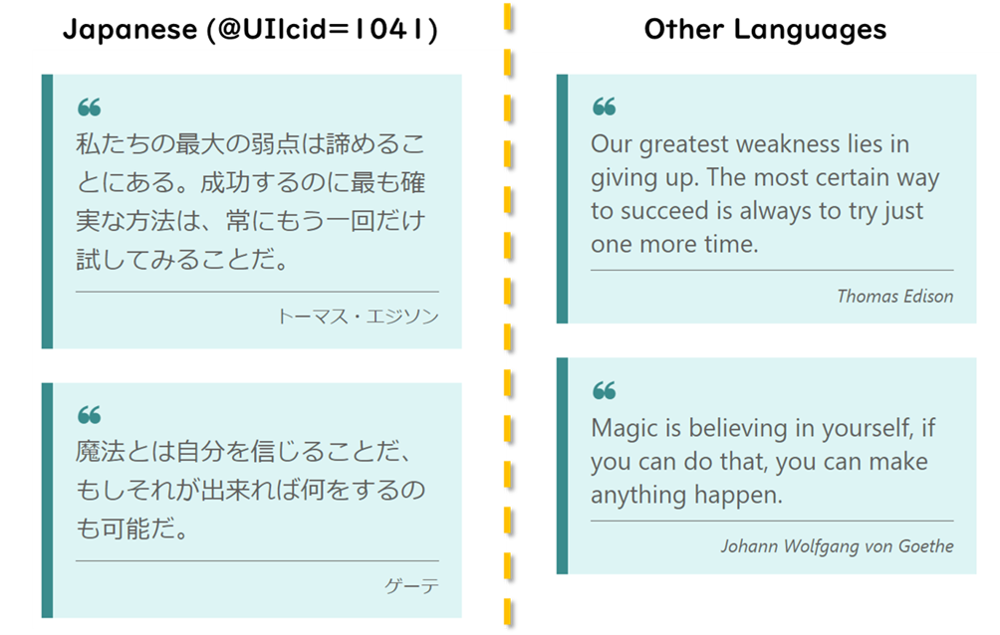

# Multilingual Quotes

## Summary

This sample demonstrates the use of the `@UIlcid` token to change the text displayed based on the site display language.

## View requirements

|Type                |Internal Name|Required|
|--------------------|-------------|:------:|
|Single line of text |Title        |Yes     |
|Single line of text |Name         |Yes     |
|Single line of text |Japanese     |Yes     |
|Single line of text |JapaneseName |Yes     |

## Sample

Solution|Author(s)
--------|---------
multilingual-quotes.json | [Tetsuya Kawahara](https://github.com/tecchan1107)

## Version history

Version |Date               |Comments
--------|-------------------|--------------------------------
1.0     |September 19, 2022 |Initial release

## Disclaimer
**THIS CODE IS PROVIDED *AS IS* WITHOUT WARRANTY OF ANY KIND, EITHER EXPRESS OR IMPLIED, INCLUDING ANY IMPLIED WARRANTIES OF FITNESS FOR A PARTICULAR PURPOSE, MERCHANTABILITY, OR NON-INFRINGEMENT.**

