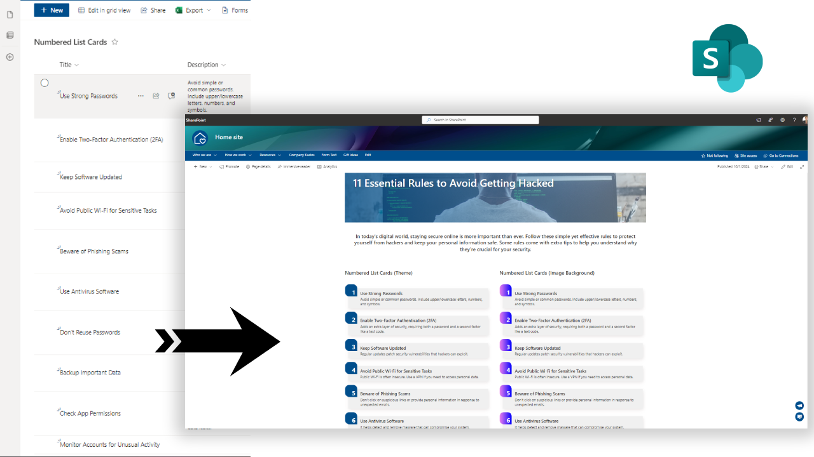

# Numbered List Card

## Summary
This sample converts list items into numbered list cards. The numbering is done using `@rowIndex` JSON formatting value. If you prefer custom ordering, create a new column and use it for sorting in the SharePoint view. To ensure the view works properly, ensure all required columns are included.

The sample includes two different JSON files: one where the numbering background uses a SharePoint theme color, and another that uses a custom image for the background.

## View requirements
|Type               |Internal Name|Required|
|-------------------|-------------|:------:|
|Single line of text|Title        |     |
|Multiple lines of text|Description  |        |

- Make sure to use the List View and include all the specified fields in the view.

## Sample

Solution|Author(s)
--------|---------
numbered-list-cards.json | [Tanel Vahk](https://github.com/tvahk)
numbered-list-cards-background.json | [Tanel Vahk](https://github.com/tvahk)

## Version history

Version |Date             |Comments
--------|-----------------|--------------------------------
1.0     |October 01, 2024 |Initial release

## Disclaimer
**THIS CODE IS PROVIDED *AS IS* WITHOUT WARRANTY OF ANY KIND, EITHER EXPRESS OR IMPLIED, INCLUDING ANY IMPLIED WARRANTIES OF FITNESS FOR A PARTICULAR PURPOSE, MERCHANTABILITY, OR NON-INFRINGEMENT.**

