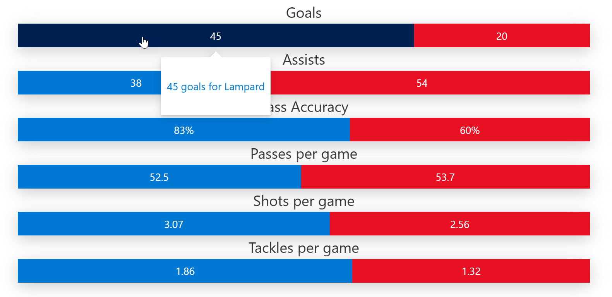

# One to one comparison chart format

## Summary
This sample formats a SharePoint list view into a chart that shows a comparison between two entities against various attributes.

This sample is dervied from [Butterfly chart format](https://github.com/pnp/List-Formatting/tree/master/view-samples/butterfly-chart-format)

## View requirements

|Type                |Internal Name|Required|
|--------------------|-------------|:------:|
|Single line of text |Title        |Yes     |
|Number              |Entity1      |Yes     |
|Number              |Entity2      |Yes     |
|Yes/No              |IsPercent    |No      |

## Sample

Solution                    |Author(s)
----------------------------|---------------------------
one-to-one-comparison-chart-format.json |[Anoop Tatti](https://twitter.com/anooptells)

## Version history

Version |Date              |Comments
--------|------------------|--------
1.0     |June 23, 2021  |Initial release

## Disclaimer
**THIS CODE IS PROVIDED *AS IS* WITHOUT WARRANTY OF ANY KIND, EITHER EXPRESS OR IMPLIED, INCLUDING ANY IMPLIED WARRANTIES OF FITNESS FOR A PARTICULAR PURPOSE, MERCHANTABILITY, OR NON-INFRINGEMENT.**

