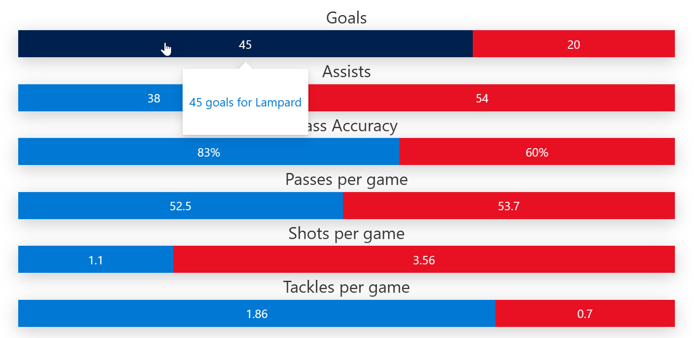

# One to one comparison chart format

## Summary
These samples format a SharePoint list view into a chart that shows a comparison between two entities against various attributes.

These samples are dervied from [Butterfly chart format](https://github.com/pnp/List-Formatting/tree/master/view-samples/butterfly-chart-format)

## One to one comparison chart format

## View requirements

|Type                |Internal Name|Required|Details|
|--------------------|-------------|:------:|-------|
|Single line of text |Title        |Yes     |The attribute against which the stats are measured|
|Single line of text |Icon         |No      |Icon to represent the attribute|
|Number              |Entity1      |Yes     |The stat for first entity|
|Number              |Entity2      |Yes     |The stat for second entity|
|Yes/No              |IsPercent    |No      |Is the stat is in percentage|
|Image               |Entity1Image |No      |Image to represent the first entity. Will be only displayed for the first row at the top left. |
|Image               |Entity2Image |No      |Image to represent the second entity. Will be only displayed for the first row at the top right.|

## One to one comparison chart format without images

## View requirements

|Type                |Internal Name|Required|
|--------------------|-------------|:------:|
|Single line of text |Title        |Yes     |
|Number              |Entity1      |Yes     |
|Number              |Entity2      |Yes     |
|Yes/No              |IsPercent    |No      |

## Sample

Solution                    |Author(s)
----------------------------|---------------------------
one-to-one-comparison-chart-format.json |[Anoop Tatti](https://twitter.com/anooptells)
one-to-one-comparison-chart-format-without-images.json |[Anoop Tatti](https://twitter.com/anooptells)

## Version history

Version |Date              |Comments
--------|------------------|--------
1.0     |June 23, 2021  |Initial release

## Disclaimer
**THIS CODE IS PROVIDED *AS IS* WITHOUT WARRANTY OF ANY KIND, EITHER EXPRESS OR IMPLIED, INCLUDING ANY IMPLIED WARRANTIES OF FITNESS FOR A PARTICULAR PURPOSE, MERCHANTABILITY, OR NON-INFRINGEMENT.**

