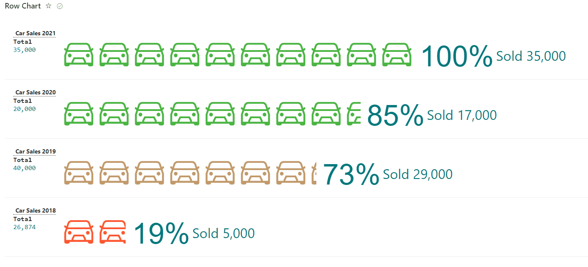
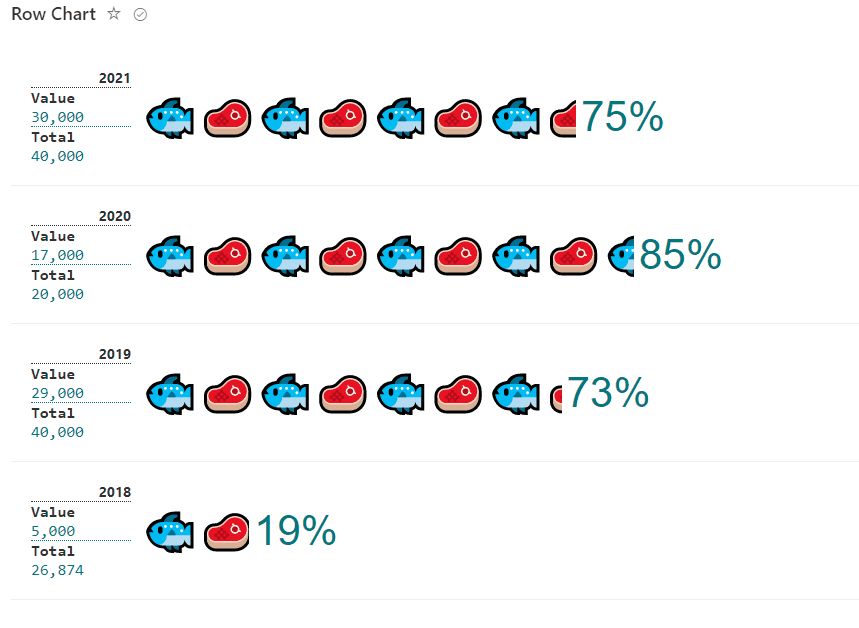
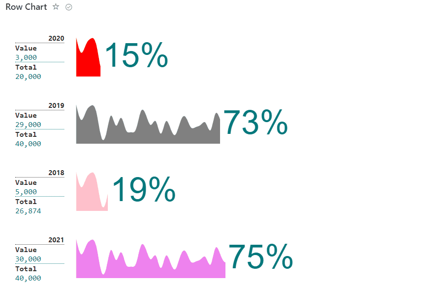

# Percent chart format

## Summary
This sample display formatted percent chart row based on icon/emoji/svg and associated result number, used is able to manage to total and used items for percent calculation. 

### Icons format

### Emojis format

### SVG format

## View requirements
- The format expect the following fields:

Field |Type
--------|---------
Title | Single line of text.
Total | Number - Total amount to calculate percentage (100%)
Value | Number - How many were used from Total amount used in Percentage calculator.
Year | Single line of text - Date.
Color | Single line of text - Color for svg.

### Edit List View requirements

- Access to List Settings > access to "**Views**" area and select created view.
- Edit View where format will be included:
   - Access to "**Sort**" Area and select column "**Year**" and check as **descending order**, this option order the cards based on changed.

## Sample

Solution|Author(s)
--------|---------
percent-chart-format.json | [André Lage](https://github.com/aaclage)
carsales-format.json | [André Lage](https://github.com/aaclage)
fishmeat-format.json | [André Lage](https://github.com/aaclage)

## Version history

Version|Date|Comments
-------|----|--------
1.0|April 22, 2022|Initial release

## Disclaimer
**THIS CODE IS PROVIDED *AS IS* WITHOUT WARRANTY OF ANY KIND, EITHER EXPRESS OR IMPLIED, INCLUDING ANY IMPLIED WARRANTIES OF FITNESS FOR A PARTICULAR PURPOSE, MERCHANTABILITY, OR NON-INFRINGEMENT.**

