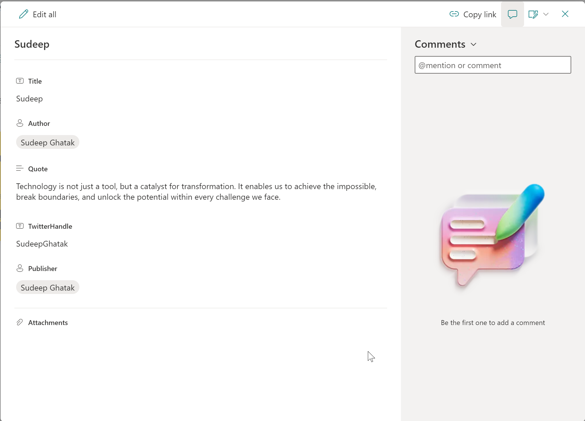

# Person Quote Card

## Summary

This sample transforms list items into a template that displates quotes from People with a link to their Twitter (X) handle. The columns listed below must be included in the list view.

## View requirements

Column Name                 | Type
----------------------------|-----------------------------------------
Title                       | Single line of text
Quote                       | Single line of text
TwitterHandle               | Single line of text
Publisher                   | Person or Group

## Sample

Solution|Author
--------|---------
person-quote.json | [Sudeep Ghatak](https://www.linkedin.com/in/sudeepghatak/) 

## Version history

Version|Date|Comments
-------|----|--------
1.0|January 09, 2025|Initial release

## Disclaimer
**THIS CODE IS PROVIDED *AS IS* WITHOUT WARRANTY OF ANY KIND, EITHER EXPRESS OR IMPLIED, INCLUDING ANY IMPLIED WARRANTIES OF FITNESS FOR A PARTICULAR PURPOSE, MERCHANTABILITY, OR NON-INFRINGEMENT.**

---

## Additional notes

None

