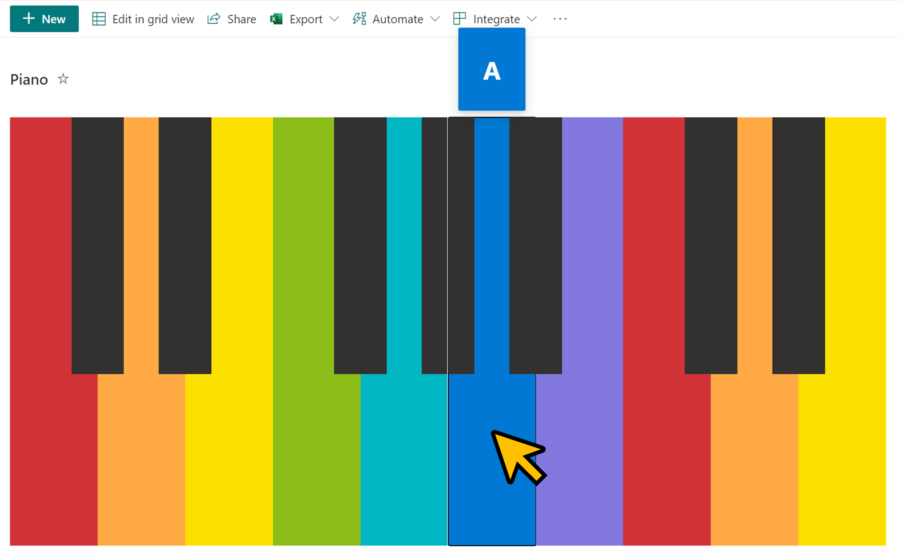

# Piano Format

## Summary
This sample formats your SharePoint list view to look like a piano.

theme-color-piano-format.json

rainbow-color-piano-format.json

## View requirements

Column Name   |Type
--------------|--------------
Title         | Single Line Text

Set up the view so that the note names are displayed in order starting with C.

## Sample

Solution                        |Author(s)
--------------------------------|---------------------------
theme-color-piano-format.json   |[Tetsuya Kawahara](https://twitter.com/techan_k)
rainbow-color-piano-format.json |[Tetsuya Kawahara](https://twitter.com/techan_k)

## Version history

Version |Date               |Comments
--------|-------------------|--------
1.0     |September 28, 2021 |Initial release

## Disclaimer
**THIS CODE IS PROVIDED *AS IS* WITHOUT WARRANTY OF ANY KIND, EITHER EXPRESS OR IMPLIED, INCLUDING ANY IMPLIED WARRANTIES OF FITNESS FOR A PARTICULAR PURPOSE, MERCHANTABILITY, OR NON-INFRINGEMENT.**

