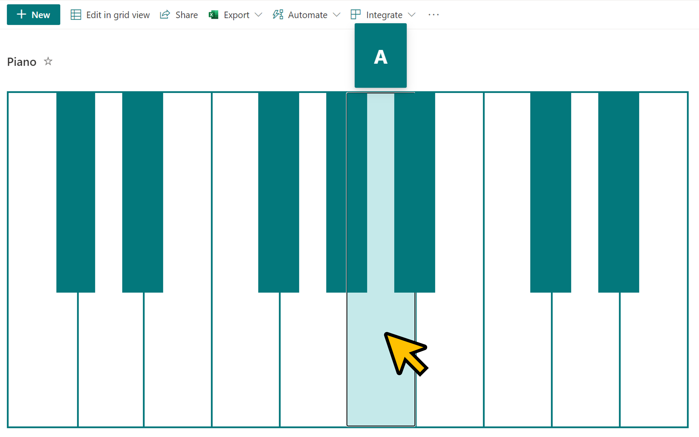
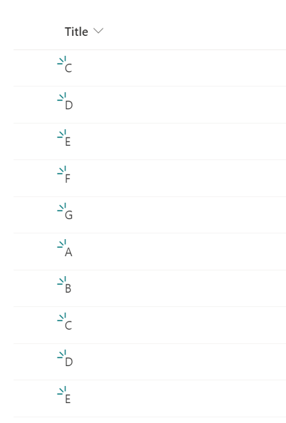

# Piano

## Summary
This sample formats your SharePoint list view to look like a piano.

### piano.json

Uses your site's theme color:

### piano-rainbow.json

Uses rainbow colors:

## View requirements

Column Name   |Type
--------------|--------------
Title         | Single Line Text

Set up the view so that the note names are displayed in order starting with C:

## Sample

Solution|Author(s)
--------|---------
piano.json | [Tetsuya Kawahara](https://github.com/tecchan1107)
piano-rainbow.json | [Tetsuya Kawahara](https://github.com/tecchan1107)

## Version history

Version |Date               |Comments
--------|-------------------|--------
1.0     |September 28, 2021 |Initial release

## Disclaimer
**THIS CODE IS PROVIDED *AS IS* WITHOUT WARRANTY OF ANY KIND, EITHER EXPRESS OR IMPLIED, INCLUDING ANY IMPLIED WARRANTIES OF FITNESS FOR A PARTICULAR PURPOSE, MERCHANTABILITY, OR NON-INFRINGEMENT.**

