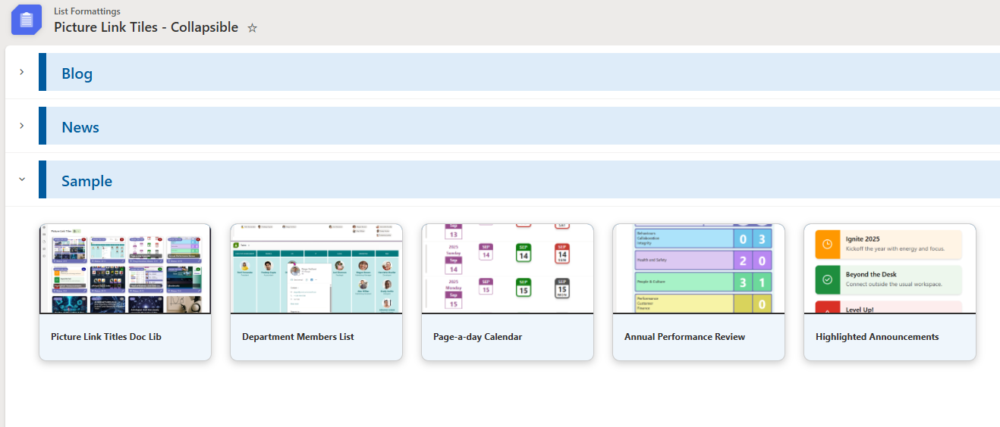
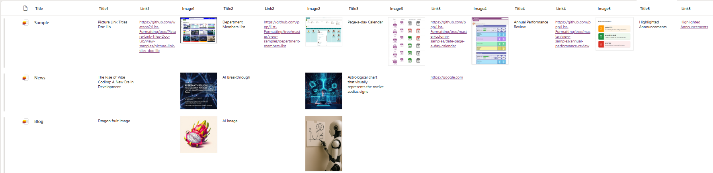

# Picture Link Tiles - Collapsible

## Summary

Currently, Gallery view allows formatting of group headers, but it does not support built-in or JSON-based expand and collapse behavior like List view. This sample demonstrates how to render list items as cards, where you can choose which field values are displayed within each card and define target links.

## View requirements
Column Name         | Type                   | Setting
--------------------|------------------------|-
Title               | Single line of text    | Group by column
Title1              | Single line of text
Title2              | Single line of text
Title3              | Single line of text
Title4              | Single line of text
Title5              | Single line of text
Link1               | Hyperlink
Link2               | Hyperlink
Link3               | Hyperlink
Link4               | Hyperlink
Link5               | Hyperlink
Image1              | Image
Image2              | Image
Image3              | Image
Image4              | Image
Image5              | Image

> [!NOTE]
> All columns must be included in the view and grouped by the `Title` column.

## Sample
Solution|Author(s)
--------|---------
picture-link-tiles-collapsible.json | [Watana](https://github.com/watana2)

## Version history
Version|Date|Comments
-------|----|-
1.0    | January 7, 2026 | Initial release.

## Disclaimer
**THIS CODE IS PROVIDED *AS IS* WITHOUT WARRANTY OF ANY KIND, EITHER EXPRESS OR IMPLIED, INCLUDING ANY IMPLIED WARRANTIES OF FITNESS FOR A PARTICULAR PURPOSE, MERCHANTABILITY, OR NON-INFRINGEMENT.**

