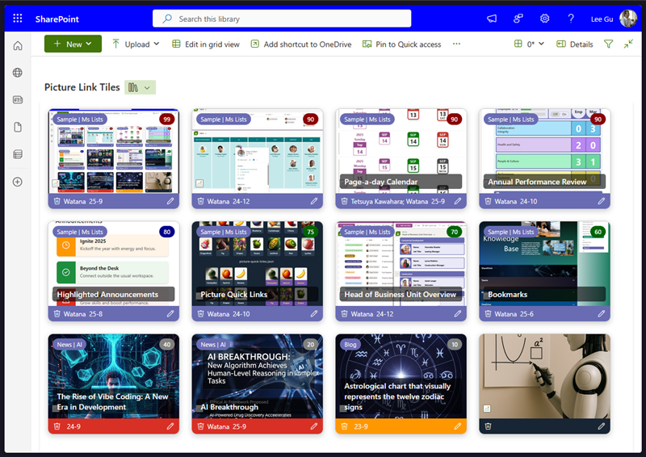
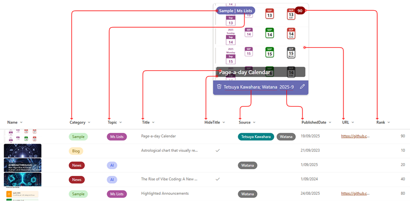

# Picture Link Tiles Doc Lib

## Summary
This sample turns each item into a card-style tile view in a SharePoint Document Library that:
* Shows a file preview thumbnail. If a URL exists, clicking the preview opens the URL, otherwise, it opens the current file.
* Displays a Category | Topic badge on the top left, inline editable.
* Shows a Rank badge on the top right with background color based on value: >89 dark red, >79 dark blue, >49 dark green, else gray. Also inline editable.
* Displays the Title as an overlay, hidden if HideTitle is true or Title is empty. Also inline editable.
* Includes a footer with a delete button, source, published date, and an edit button.
* Changes the footer’s background color based on the category: News red, Blog orange, Sample purple.

## View requirements
Column Name         | Type                   | Setting
--------------------|------------------------|-
Title               | Single line of text    |
URL                 | Hyperlink              |
PublishedDate       | Date and Time          | Date only
Source              | Choice                 | Allow multiple selections = Yes
Category            | Choice                 | Sample, News, Blog,...
Topic               | Choice                 |
Rank                | Number                 | Default value = 0, Number of decimal places = 0,
HideTitle           | Yes/No                 | Default value = No

> [!NOTE]
> It is necessary to include these columns in the gallery view or it won't work as excpected.

## Sample
Solution|Author(s)
--------|-
picture-link-tiles-doc-lib.json | [Watana](https://github.com/watana2)

## Version history
Version|Date|Comments
-------|----|-
1.0    | September 24, 2025 | Initial release

## Disclaimer
**THIS CODE IS PROVIDED *AS IS* WITHOUT WARRANTY OF ANY KIND, EITHER EXPRESS OR IMPLIED, INCLUDING ANY IMPLIED WARRANTIES OF FITNESS FOR A PARTICULAR PURPOSE, MERCHANTABILITY, OR NON-INFRINGEMENT.**

