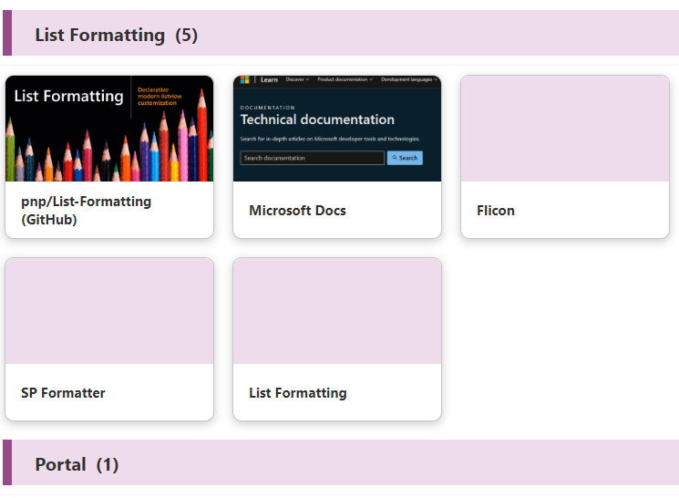

# Picture Link Titles

## Summary
This sample displays a link collection with pictures using the Gallery view and group header formatting. Originally created by Tetsuya Kawahara, the author of [Link Collection using Emojis](https://github.com/pnp/List-Formatting/tree/master/view-samples/emoji-link-tiles), this is just a picture version.

## View requirements

Type               |Internal Name|Required
-------------------|-------------|--------
Single line of text|Title        |Yes
Single line of text|Category     |Yes
Single line of text|URL          |Yes
Image              |Image        |No

Group the view by `Category` column.

## Sample

Solution|Author(s)
--------|---------
picture-link-tiles.json | [Tetsuya Kawahara](https://github.com/tecchan1107) ([@techan_k](https://twitter.com/techan_k)) & [Watana](https://github.com/watana2)

## Version history

Version |Date             |Comments
--------|-----------------|--------
1.0     |December 1, 2024 |Initial release

## Disclaimer
**THIS CODE IS PROVIDED *AS IS* WITHOUT WARRANTY OF ANY KIND, EITHER EXPRESS OR IMPLIED, INCLUDING ANY IMPLIED WARRANTIES OF FITNESS FOR A PARTICULAR PURPOSE, MERCHANTABILITY, OR NON-INFRINGEMENT.**

