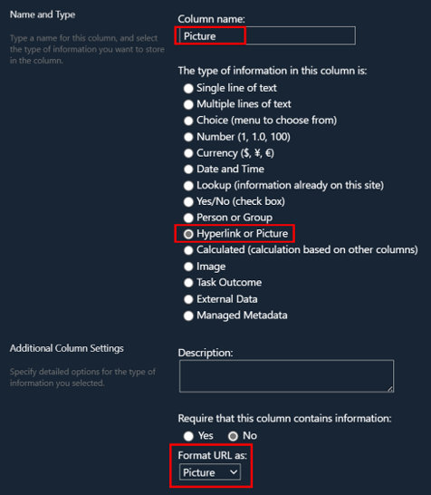

# Picture Quick Links

## Summary
This sample shows custom quick links for adding to a vertical section in a SharePoint page.

Images are stored in a central location, so updating an image automatically updates it everywhere it's used. This is especially useful for large companies with many divisions and departments.

## View requirements

- The view must be set to gallery.
- This format expects the following columns to be part of the view:

    Field Name | Required | Typec
    ---------- | -------- | ----
    Link | Yes | Hyperlink or Picture (Format URL as: Hyperlink)
    Picture | Yes | Hyperlink or Picture (Format URL as: Picture)

    > [!TIP]
    > Image column types doesn't allow manual path input.Text column type allows it but requires an additional view to display. Hyperlink or Picture column types as the name suggested, it can be used for pictures only or hyperlinks. Picture in this case fitting the purpose of displaying images.

    

## Sample

Solution|Author(s)
--------|---------
picture-quick-links.json | [Watana](https://github.com/watana2)
picture-quick-links-compact.json | [Watana](https://github.com/watana2)
picture-quick-links-compact-purple.json | [Watana](https://github.com/watana2)

## Version history

Version|Date|Comments
-------|----|--------
1.0|September 16, 2024|Initial release

## Disclaimer

**THIS CODE IS PROVIDED *AS IS* WITHOUT WARRANTY OF ANY KIND, EITHER EXPRESS OR IMPLIED, INCLUDING ANY IMPLIED WARRANTIES OF FITNESS FOR A PARTICULAR PURPOSE, MERCHANTABILITY, OR NON-INFRINGEMENT.**

---

## Additional notes

