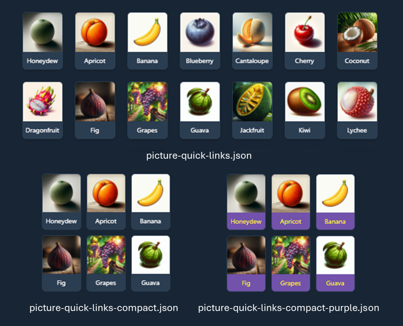
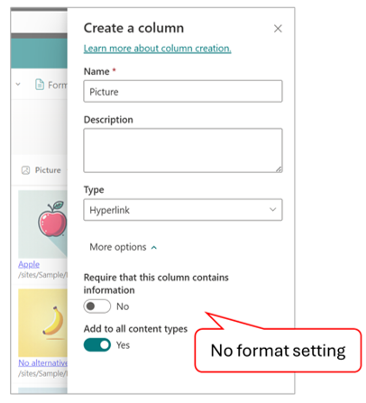
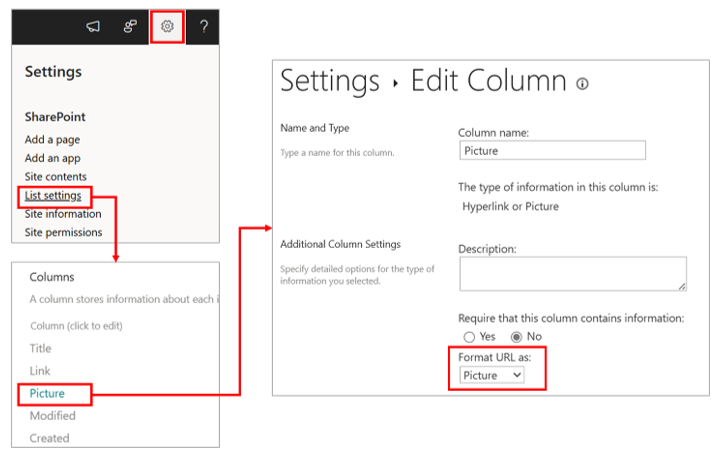
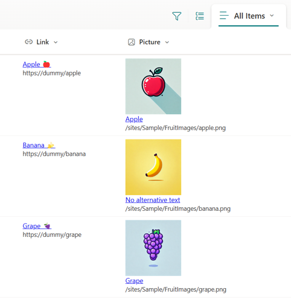

# Picture Quick Links

## Summary
This sample shows custom quick links for adding to a vertical section in a SharePoint page.

Images are stored in a central location, so updating an image automatically updates it everywhere it's used. This is especially useful for large companies with many divisions and departments.

## View requirements

- The view must be set to gallery.
- This format expects the following columns to be part of the view:

    Field Name | Required | Type
    ---------- | -------- | ----
    Link | Yes | Hyperlink or Picture (Format URL as: Hyperlink)
    Picture | Yes | Hyperlink or Picture (Format URL as: Picture)

> [!NOTE]
> - The hyperlink column format cannot be set to Picture in the modern column create or edit pane.  
>     
> 
>     To set the hyperlink column format to Picture, you must do so from the classic create or edit column screen.  
>     
> 
> - When setting an external site's image URL in the `Picture` column, the image may not be displayed. This happens when attempting to retrieve images from a domain that is not allowed. To enable image display, you'll need to configure the HTML Field Security settings. For more details, refer to [Allow or restrict the ability to embed content on SharePoint pages](https://support.microsoft.com/office/allow-or-restrict-the-ability-to-embed-content-on-sharepoint-pages-e7baf83f-09d0-4bd1-9058-4aa483ee137b).

## Sample

Solution|Author(s)
--------|---------
picture-quick-links.json | [Watana](https://github.com/watana2)
picture-quick-links-compact.json | [Watana](https://github.com/watana2)
picture-quick-links-compact-purple.json | [Watana](https://github.com/watana2)

## Version history

Version|Date|Comments
-------|----|--------
1.0|September 16, 2024|Initial release

## Disclaimer

**THIS CODE IS PROVIDED *AS IS* WITHOUT WARRANTY OF ANY KIND, EITHER EXPRESS OR IMPLIED, INCLUDING ANY IMPLIED WARRANTIES OF FITNESS FOR A PARTICULAR PURPOSE, MERCHANTABILITY, OR NON-INFRINGEMENT.**

---

## Additional notes

If you create a list view and apply [hyperlink-display-url](/column-samples/hyperlink-display-url) to format the `Link` or `Picture` columns, you can display the URLs set in the hyperlink column on the view, making it easier to check the link destinations and manage maintenance.

