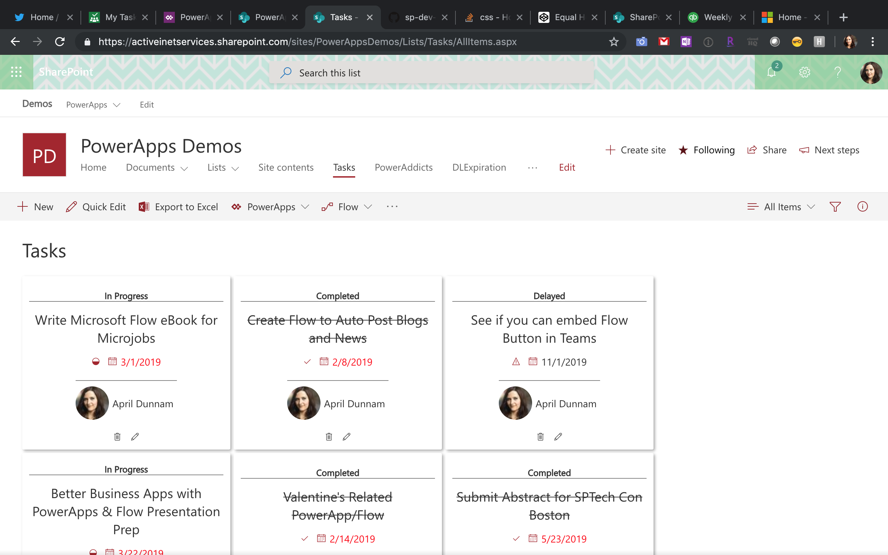

# Planner Inspired Task Cards

## Summary
Formats Task List Items in a Planner Inspired Card View.  Uses OfficeUIFabric Icons to designate "In Progress", "Completed" and "Delayed" Statuses.  Automatically strikes out text for "Completed" items.  

## View requirements

|Type|Internal Name|Required|
|---|---|:---:|
|Single line of text|Title|Yes|
|AssignedTo|User|Yes|
|Status|Choice|No|
|Due Date|DateTime|No|

## Sample

Solution|Author(s)
--------|---------
planner-inspired-task-card | [April Dunnam](https://twitter.com/aprildunnam)

## Version history

Version|Date|Comments
-------|----|--------
1.0|July 26, 2019|Initial release

## Disclaimer
**THIS CODE IS PROVIDED *AS IS* WITHOUT WARRANTY OF ANY KIND, EITHER EXPRESS OR IMPLIED, INCLUDING ANY IMPLIED WARRANTIES OF FITNESS FOR A PARTICULAR PURPOSE, MERCHANTABILITY, OR NON-INFRINGEMENT.**

---