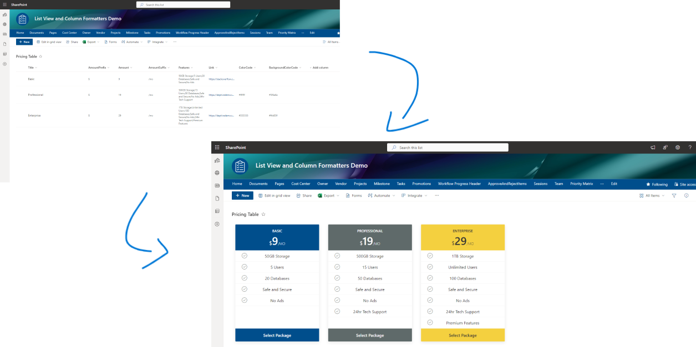
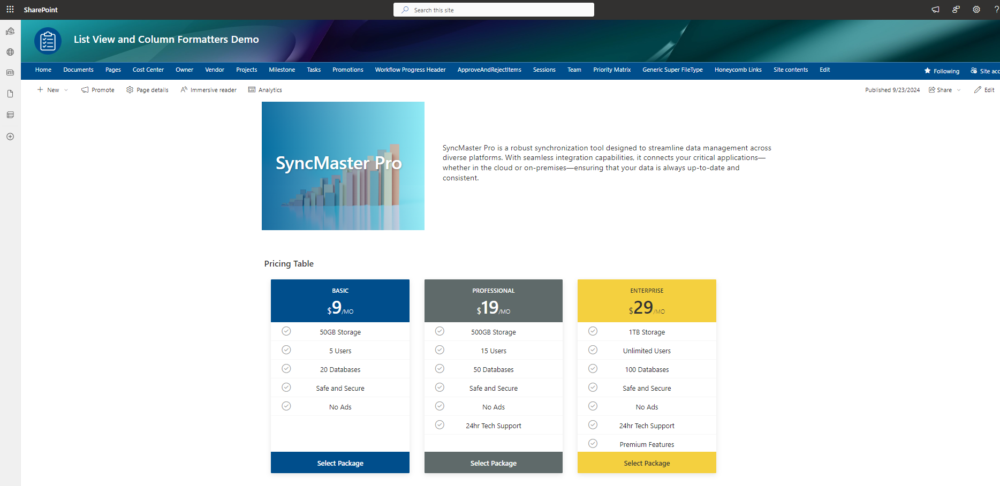

# Pricing Table

## Summary
This sample transforms list items into cards formatted with pricing table layouts. To ensure the view functions correctly, make sure all specified columns are included. For the Features section in the pricing table, populate the Feature column with all the values separated by semicolons.

  

## View requirements
|Type               |Internal Name|Required|
|-------------------|-------------|:------:|
|Single line of text|Title        |Yes     |
|Number             |Amount       |Yes     |
|Single line of text|AmountSuffix   |        |
|Single line of text|AmountPrefix   |        |
|Single line of text|BackgroundColorCode   |        |
|Single line of text|ColorCode   |        |
|Multiple lines of text|Features   |        |
|Hyperlink or Picture|Link   |Yes     |

- Make sure to use the Gallery View and include all the specified fields in the view.
- For the Features section in the pricing table, populate the Feature column with all the values separated by semicolons.

## Sample

Solution|Author(s)
--------|---------
pricing-table.json | [Tanel Vahk](https://github.com/tvahk)

## Version history

Version |Date             |Comments
--------|-----------------|--------------------------------
1.0     |September 23, 2024 |Initial release

## Disclaimer
**THIS CODE IS PROVIDED *AS IS* WITHOUT WARRANTY OF ANY KIND, EITHER EXPRESS OR IMPLIED, INCLUDING ANY IMPLIED WARRANTIES OF FITNESS FOR A PARTICULAR PURPOSE, MERCHANTABILITY, OR NON-INFRINGEMENT.**

