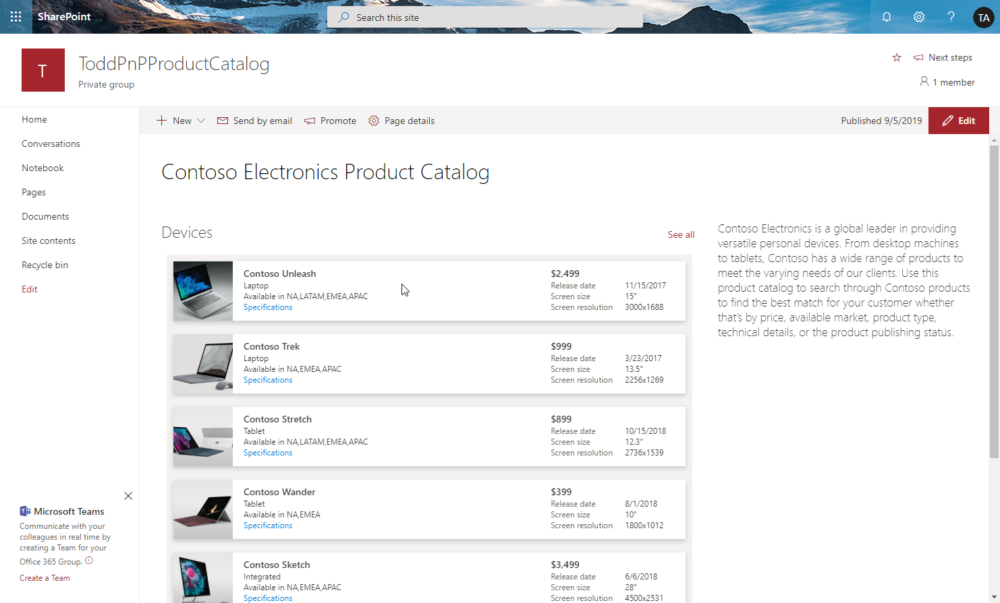
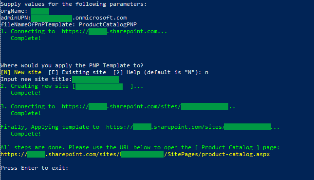

# Product Catalog

## Summary
The product catalog sample demonstrates how to use view formatting to format lists and display views of the lists inside web parts. It also demonstrates how to create links to download documents from SharePoint Document libraries.

## View requirements

This solution is comprised of 2 libraries, a list, and multiple files. This is a complicated setup. Fortunately, you can also have all lists (including sample data) setup for you by using the provisioning instructions below.

### Prerequisites

Install **PnP PowerShell modules** 

* **To install PnP PowerShell modules, open PowerShell as an administrator and run the following command:**  
   
  ``Install-Module SharePointPnPPowerShellOnline -AllowClobber``

### Deployment 
 
1. Open PowerShell as an administrator and go to the provisioning folder where the script is located. Then run the following command: 

   ``.\ProductCatalog.ps1``   
      
   **Notes**: 
   * Please make sure all files are downloaded, including the two folders "**documents**" and "**images**". 

   * Before the script will run, the following "**Security Warning**" may appear, type R to allow the script to run:

   

   * After entering the adminUPN you will be asked for the user password in a pop up window.
   
      
      
2. Please refer to the below table to enter the parameters:

| **Name**                      | **Value**                   | **Description**                                              |
| ----------------------------- | --------------------------- | ------------------------------------------------------------ |
| **orgName**                   | \<orgName\>                       | The name of the tenant.                                          |
| **adminUPN**                  | \<user\>@\<orgName\>.onmicrosoft.com | The site administrator account.  For example:  If your SharePoint URL is http://contoso.sharepoint.com then your orgName is contoso. |
| **fileNameOfPnPTemplate** | ProductCatalogPNP           | The file name of the **PnP Provisioning Template**.  |

3. Please choose if you would like to apply the PnP Template to existing site or a new site.

| **Name**                      | **Value**                   | **Description**                                              |
| ----------------------------- | --------------------------- | ------------------------------------------------------------ |
| **Input new site title**      | \<Site Title\>              | The title for the new site.                                  |
| **Input existing site url**   | \<Existing Site URL\> | The url of existing site.                |

After the script has successfully run you will see the following screen.

    

4. Copy the [Product Catalog] URL.
 
5. Open a web broswer and navigate to the URL.
 
6. Verify the page appears like this:

 

## Sample

Solution|Author(s)
--------|---------
product-catalog.json | [Todd Baginski](https://github.com/TBag), Chris McNulty, Chad Liu, Damian Gibbs, Randy Wang
product-catalog-library.json | [Todd Baginski](https://github.com/TBag), Chris McNulty, Chad Liu, Damian Gibbs, Randy Wang

## Version history

Version|Date|Comments
-------|----|--------
1.0|January 29, 2020|Initial release

## Disclaimer

**THIS CODE IS PROVIDED *AS IS* WITHOUT WARRANTY OF ANY KIND, EITHER EXPRESS OR IMPLIED, INCLUDING ANY IMPLIED WARRANTIES OF FITNESS FOR A PARTICULAR PURPOSE, MERCHANTABILITY, OR NON-INFRINGEMENT.**

---

