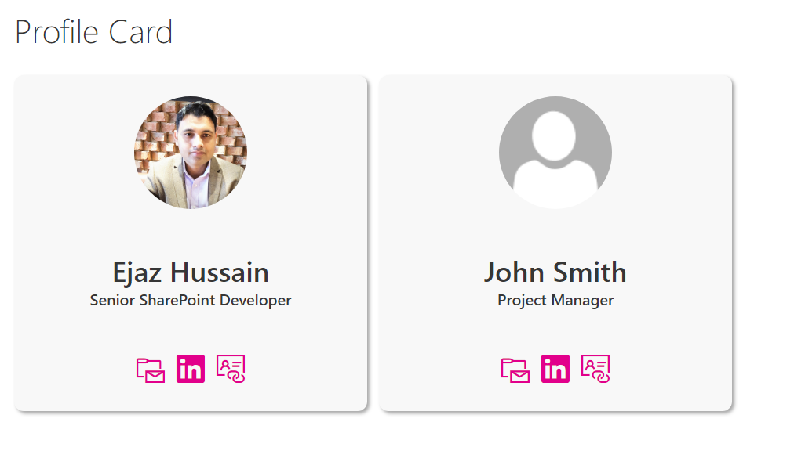

# User Profile Card

## Summary
This is simple user profile card built using following list fields

- Showing default image icon if picture url is not given
- I did use rowFormatter, hideListHeader, hideSelection

|Type|Internal Name|Required|
|---|---|:---:|
|Single line of text|Job Title|No|
|Person or Group|User|No|
|Hyperlink or Picture|Picture|No|
|Hyperlink or Picture|LinkedIn|No|
|Hyperlink or Picture|Twitter|No|

## Sample

Solution|Author(s)
--------|---------
Profile-card | [Ejaz Hussain](https://twitter.com/ejazhussain_)

## Version history

Version|Date|Comments
-------|----|--------
1.0|March 13, 2019|Initial release

## Disclaimer
**THIS CODE IS PROVIDED *AS IS* WITHOUT WARRANTY OF ANY KIND, EITHER EXPRESS OR IMPLIED, INCLUDING ANY IMPLIED WARRANTIES OF FITNESS FOR A PARTICULAR PURPOSE, MERCHANTABILITY, OR NON-INFRINGEMENT.**

