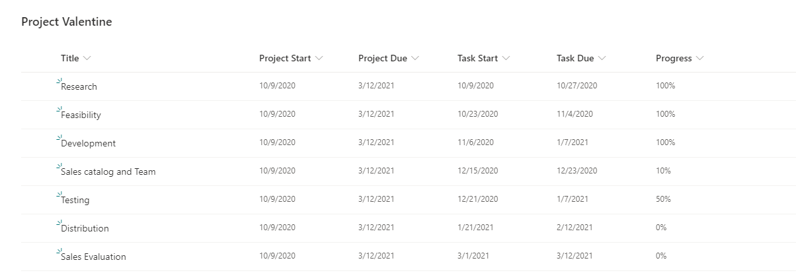

# Project Gantt Chart View

## Summary
This project Gantt Chart sample demonstrates how to show a list of high level tasks in a Gantt chart. It is mainly useful for top-level views.

So this

  

Turns into this

  

## View requirements
This format expects the following columns to be part of the view:

|Type|Internal Name|Required|
|---|---|:---:|
|Single line of text|Title|Yes|
|Date|ProjectStart|Yes|
|Date|ProjectDue|Yes|
|Date|TaskStart|Yes|
|Date|TaskDue|Yes|
|Number|Progress|Yes|

The view should be sorted by `TaskStart`, ascending

## Sample

Solution|Author(s)
--------|---------
Project-Gantt-Chart | [Geert de Kooter](https://twitter.com/gdekooter)

## Version history

Version|Date|Comments
-------|----|--------
1.0|November 1, 2020|Initial release
2.0|February 10, 2021| Added status Progress indicator, current date indicator, and width fixes

## Disclaimer
**THIS CODE IS PROVIDED *AS IS* WITHOUT WARRANTY OF ANY KIND, EITHER EXPRESS OR IMPLIED, INCLUDING ANY IMPLIED WARRANTIES OF FITNESS FOR A PARTICULAR PURPOSE, MERCHANTABILITY, OR NON-INFRINGEMENT.**

---

## Additional notes

None

