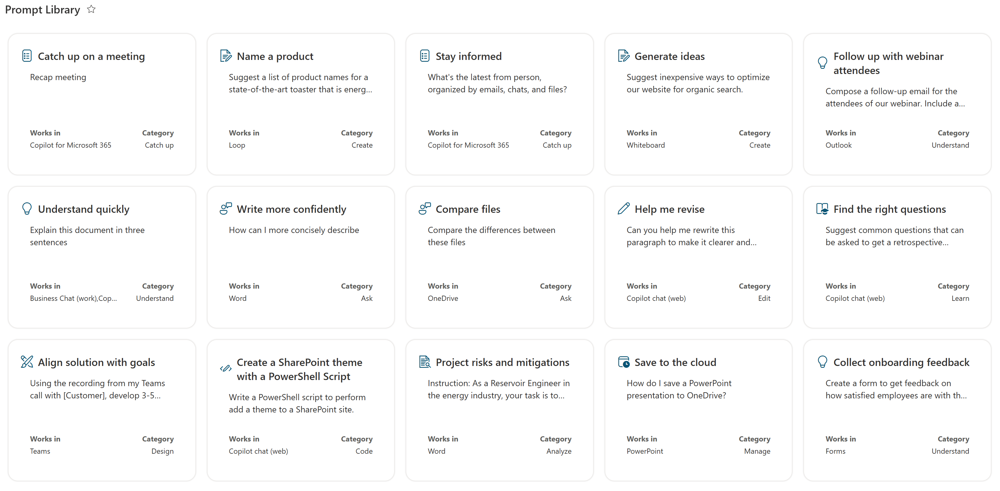

# Prompt Cards

## Summary
This sample demonstrates how to format list items as prompt cards. The design is inspired from the [Copilot Lab](https://copilot.cloud.microsoft/en-US/prompts/all) prompt library. It features the following:
- **Responsive tile layout:** Items are displayed in a card-based layout that adjusts to different screen sizes.
- **Conditional Icons:** Icons change dynamically based on the value of the **PromptCategory** column.
- **Theme Color Classes:** Uses theme color classes to ensure the format displays as intended regardless of the site's theme (light, dark, custom, etc.).
- **Gallery View:** The formatting is designed to work with the Gallery view style.

## View requirements

**Important:** This formatting depends on the Gallery view style. Make sure to set your view to Gallery before applying the formatting.

|Type|Internal Name|Required|
|---|---|:---:|
|Single line of text|Title|Yes|
|Multiple lines of text|Prompt|Yes|
|Choice|PromptCategory|Yes|
|Choice (allow multiple)|Worksin|Yes|
|Calculated (Single line of text)|Icon|Yes|

### Column Details

- **Title (Single line of text):** A concise name for the prompt.
- **Prompt (Multiple lines of text):** The full text of the prompt.
- **PromptCategory (Choice):** Categorize prompts for easy filtering. Choices include:
  - Understand
  - Create
  - Catch up
  - Ask
  - Edit
  - Learn
  - Design
  - Code
  - Analyze
  - Manage
- **Works in (Choice - allow multiple selections):** Specify applications or contexts where the prompt is effective. Choices include:
  - Business Chat (work)
  - Copilot chat (web)
  - ChatGPT
  - GitHub Copilot
  - Teams
  - Outlook
  - Word
  - Excel
  - PowerPoint
  - OneNote
  - Loop
  - Whiteboard
  - SharePoint
  - OneDrive
  - Planner
  - Stream
  - Forms
  - Viva Engage
- **Make it your own (Multiple lines of text):** Additional details or tips on how to customize or adapt the prompt.
- **Icon (Calculated - Single line of text):** This column calculates the appropriate icon based on the **PromptCategory**.
You need the **Icon** calculated column to display the icon associated with the **PromptCategory** column. Use the following formula for this calculated column:

`=IF(ISBLANK([PromptCategory]),"PageEdit",IF([PromptCategory]="Understand","Lightbulb",IF([PromptCategory]="Create","TextDocumentEdit",IF([PromptCategory]="Catch up","PageList",IF([PromptCategory]="Ask","Feedback",IF([PromptCategory]="Edit","Edit",IF([PromptCategory]="Learn","LearningTools",IF([PromptCategory]="Design","EditCreate",IF([PromptCategory]="Code","CodeEdit",IF([PromptCategory]="Analyze","ComplianceAudit",IF([PromptCategory]="Manage","DateTime","PageEdit")))))))))))`

If you'd like to require approval before the prompt is shown in the prompt library list, you can use Microsoft Power Automate to request approval when a SharePoint item is created and use the "Stop sharing an item or a file" action until the item is approved.

## Sample

Solution|Author(s)
--------|---------
prompt-cards.json | [Pat McGown](https://github.com/pmcgown) ([@pmcgown](https://x.com/pmcgown))

## Version history

Version|Date|Comments
-------|----|--------
1.0|October 8, 2024 |Initial release

## Disclaimer
**THIS CODE IS PROVIDED *AS IS* WITHOUT WARRANTY OF ANY KIND, EITHER EXPRESS OR IMPLIED, INCLUDING ANY IMPLIED WARRANTIES OF FITNESS FOR A PARTICULAR PURPOSE, MERCHANTABILITY, OR NON-INFRINGEMENT.**

---

