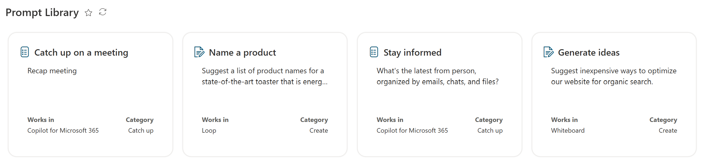

# Prompt Cards

## Summary
This sample demonstrates how to format a list items as prompt cards. The design is inspired from the [Copilot Lab](https://copilot.cloud.microsoft/en-US/prompts/all) prompt library. It features the following:
- Responsive tile layout
- Conditionally showing icons based on a column value
- Conditionally changing the text which shows based on if the persons birthday is the current date
- Row Actions
  - Emailing the person with a pre-filled Happy Birthday Subject
- Use of theme color classes to ensure the format displays as intended regardless of theme (light, dark, custom, etc.)

## View requirements

|Type|Internal Name|Required|
|---|---|:---:|
|Single line of text|Title|Yes|
|Multiple lines of text|Prompt|Yes|
|Choice|Prompt Category||Yes|
|Choice|Works in
|Multiple lines of text|Make it your own
|Calculated Column|Icon

You need the Icon calculated column so that it shows the Icon associated with the Prompt Category column. The default formula for this calculated column is below:

`=IF(ISBLANK([Prompt Category]),"PageEdit",IF([Prompt Category]="Understand","Lightbulb",IF([Prompt Category]="Create","TextDocumentEdit",IF([Prompt Category]="Catch up","PageList",IF([Prompt Category]="ask","Feedback",IF([Prompt Category]="Edit","Edit",IF([Prompt Category]="Learn","LearningTools",IF([Prompt Category]="Design","EditCreate",IF([Prompt Category]="Code","CodeEdit",IF([Prompt Category]="Analyze","ComplianceAudit",IF([Prompt Category]="Manage","DateTime","PageEdit")))))))))))`

To make this a truly automated process, you can use Microsoft Flow to pull Birthday information from your Office 365 User Profiles and populate the SharePoint list with those values.  This is a good blog post which shows how to do that: [Celebrating milestones with SharePoint, Flow, and Delve](https://techcommunity.microsoft.com/t5/SharePoint/Celebrating-milestones-with-SharePoint-Flow-and-Delve/td-p/175433)

## Sample

Solution|Author(s)
--------|---------
prompt-cards.json | [Pat McGown](https://github.com/pmcgown) ([@pmcgown](https://x.com/pmcgown))

## Version history

Version|Date|Comments
-------|----|--------
1.0|October 10, 2024 |Initial release

## Disclaimer
**THIS CODE IS PROVIDED *AS IS* WITHOUT WARRANTY OF ANY KIND, EITHER EXPRESS OR IMPLIED, INCLUDING ANY IMPLIED WARRANTIES OF FITNESS FOR A PARTICULAR PURPOSE, MERCHANTABILITY, OR NON-INFRINGEMENT.**

---

