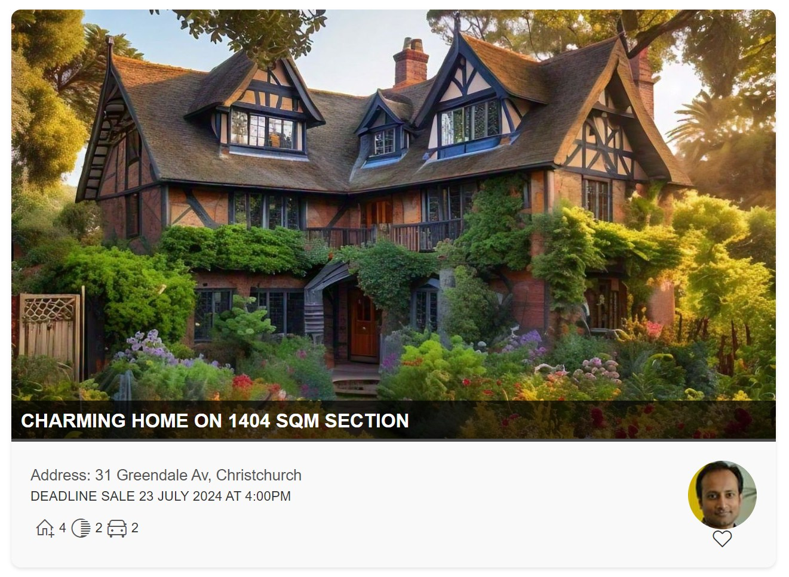

# Flashcards

## Summary

This example transforms list items into cards formatted with property listing layouts. To ensure the view functions correctly, make sure all specified columns are included. The icons are referenced from Office UI Fabric library (https://uifabricicons.azurewebsites.net/)

## View requirements

Column Name                 | Type
----------------------------|-----------------------------------------
Title                       | Single line of text
Baths                       | Number
Bedrooms                    | Number
Garages                     | Number
Carports                    | Number
Subtitle                    | Single line of text
Agent                       | Person or Group
PropertyImage               | Hyperlink or Picture
StreetAddress               | Single line of text
Favorite                    | Yes/No

## Sample

Solution|Author
--------|---------
property.json | [Sudeep Ghatak](https://www.linkedin.com/in/sudeepghatak/) 

## Version history

Version|Date|Comments
-------|----|--------
1.0|July 7, 2024|Initial release

## Disclaimer
**THIS CODE IS PROVIDED *AS IS* WITHOUT WARRANTY OF ANY KIND, EITHER EXPRESS OR IMPLIED, INCLUDING ANY IMPLIED WARRANTIES OF FITNESS FOR A PARTICULAR PURPOSE, MERCHANTABILITY, OR NON-INFRINGEMENT.**

---

