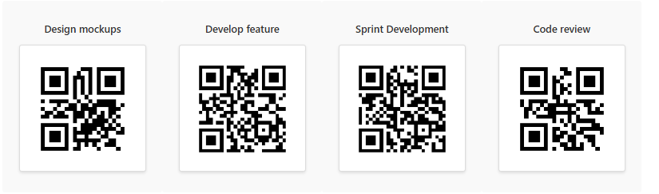

# QR Code Tile Formatter

## Summary

This sample uses **SharePoint List Formatting** to automatically generate QR codes for each list item in a tile view based on the Title field.  
Each tile displays the item title above a dynamically generated QR code in a clean, centered card layout, making it ideal for visual dashboards, inventory displays, or quick-scan directories.



## View Requirements

Create a list with the following columns:

| Internal Name   | Type               |
|-----------------|--------------------|
| **Title**       | Single line of text|

*Note: Additional columns can be added as needed for your specific use case.*

Configure the view as **Tiles** layout for the best experience.

## Sample Data

| Title                    |
|--------------------------|
| Design mockups           |
| Develop feature          |

## How it Works

- The formatter displays each list item in a **300x250px tile** with centered content
- Each tile shows the **Title** above a corresponding **QR code**
- QR codes are generated dynamically using the [QuickChart.io API](https://quickchart.io/documentation/qr-codes/)
- Each QR code contains the exact text from the **Title** field
- The layout features a modern card design with proper spacing, shadows, and rounded corners
- QR codes are displayed at 180x180 pixels with padding and border styling

## Security Configuration

**CRITICAL**: Before the QR codes will display, you must configure SharePoint security settings:

1. Navigate to **SharePoint Site**
2. Go to **Settings** > **Advanced Settings**  
3. Find **"HTML Field Security"** section
4. Add `quickchart.io` to the **allowed domains** list
5. Save the configuration

**Without this security configuration, QR codes will not display due to SharePoint's content security policies.**

## Sample

Solution|Author(s)
--------|---------
qr-code-tile.json | [Sai Bandaru](https://github.com/saiiiiiii)

## Version history

Version|Date|Comments
-------|----|--------
1.0|October 13, 2025|Initial release with tile formatter

## Disclaimer
**THIS CODE IS PROVIDED *AS IS* WITHOUT WARRANTY OF ANY KIND, EITHER EXPRESS OR IMPLIED, INCLUDING ANY IMPLIED WARRANTIES OF FITNESS FOR A PARTICULAR PURPOSE, MERCHANTABILITY, OR NON-INFRINGEMENT.**

---

## Additional Notes

### Customization Options

**Change Tile Size:**
Modify the dimensions in the JSON:
```json
"height": 350,
"width": 300
```

**Change QR Code Size:**
Modify the CSS dimensions:
```json
"style": {
  "width": "200px",
  "height": "200px"
}
```

**Use Different Data Source:**
Replace `[$Title]` with any other text field:
```json
"src": "='https://quickchart.io/qr?text=' + [$QR]"
```

**Styling Modifications:**
- Adjust background color: Change `"background-color": "#f9f9f9"`
- Modify title styling: Update font-size, color, or weight
- Customize borders and shadows: Adjust `border`, `box-shadow` values
- Change spacing: Modify `padding` and `margin-bottom` values

### Advantages of QuickChart.io
- Simple, reliable API with no authentication required
- Fast QR code generation
- Supports URL encoding for special characters
- No rate limiting for basic usage
- Clean, scannable QR codes

### Limitations
- Requires internet connectivity for QR code generation
- External dependency on QuickChart.io API
- Consider data privacy when using external QR code services
- Performance may vary with large lists due to multiple API calls
- Tile view may not be suitable for lists requiring detailed column information

### Tips for Best Results
- Keep titles concise for better QR code readability
- Test QR codes with multiple scanner apps before deployment
- Use URLs or structured data for most reliable scanning
- Consider adding a description column for additional context
- Ensure adequate lighting when scanning printed QR codes

## License
This formatting solution is provided as-is for educational and professional use. The QuickChart.io API has its own terms of service.

